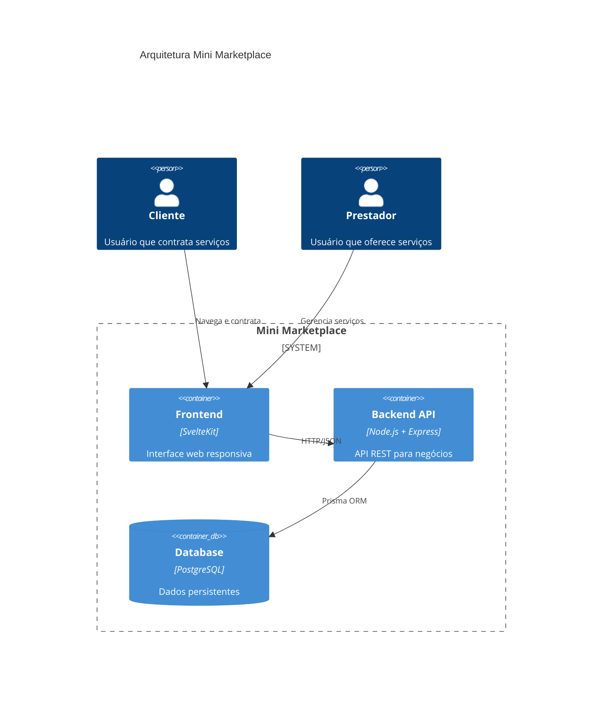
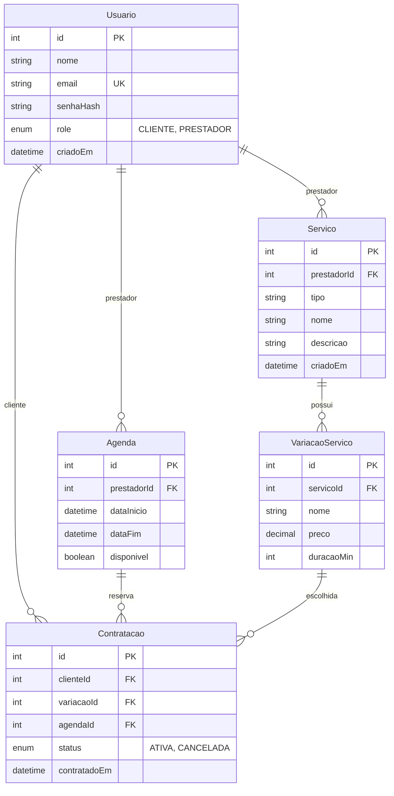
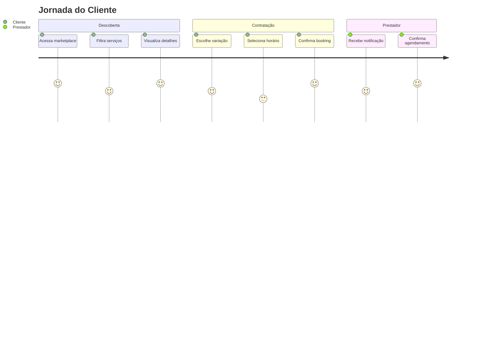

# Mini Marketplace Services

Sistema completo de marketplace para serviços locais com arquitetura moderna e containerizada.

## 🏗️ Arquitetura do Sistema



## 🚀 Stack Tecnológica

| Camada | Tecnologia | Função |
|--------|------------|--------|
| **Frontend** | SvelteKit + TailwindCSS | Interface moderna e responsiva |
| **Backend** | Node.js + Express + Prisma | API REST com ORM |
| **Database** | PostgreSQL | Persistência de dados |
| **Infra** | Docker + Docker Compose | Containerização e orquestração |

## 📊 Modelo de Dados



## 🔄 Fluxo Principal



## ⚡ Execução Rápida

```bash
# Clone e execute
git clone <repo-url>
cd mini-marketplace-services
docker-compose up -d

# Acesse:
# 🌐 Frontend: http://localhost:5173
# 🔧 Backend: http://localhost:3000  
# 🗄️ Database: localhost:5433
```

## 📁 Estrutura

```
mini-marketplace-services/
├── 🎨 frontend/           # SvelteKit App
│   ├── src/lib/components/  # Componentes UI
│   ├── src/lib/stores/      # Estado global
│   └── src/routes/          # Páginas + API routes
├── ⚙️ backend/            # Node.js API
│   ├── prisma/             # Schema + Seeds
│   └── src/routes/         # Endpoints REST
└── 🐳 docker-compose.yml  # Orquestração
```

## 🎯 Funcionalidades Core

### 👤 Cliente
- Navegar catálogo de serviços
- Filtrar por categoria/localização
- Contratar serviços com agenda
- Gerenciar contratações

### 🔧 Prestador  
- Cadastrar serviços + variações
- Definir agenda de disponibilidade
- Receber e gerenciar contratações
- Dashboard de performance

## 🔌 API Endpoints

| Método | Endpoint | Descrição |
|--------|----------|-----------|
| `GET` | `/servicos` | Lista serviços disponíveis |
| `POST` | `/servicos` | Cria serviço + variações |
| `POST` | `/contratacoes` | Efetua contratação |
| `GET` | `/contratacoes/cliente/:id` | Histórico do cliente |
| `POST` | `/usuarios` | Registra usuário |

## 🐳 Containerização

```yaml
# docker-compose.yml
services:
  db: postgres:16 (porta 5433)
  backend: node:20 (porta 3000) 
  frontend: node:20 (porta 5173)
```

**Volumes:**
- `db_data` - Persistência PostgreSQL
- `backend_node_modules` - Cache dependências
- `frontend_node_modules` - Cache dependências

## 🚧 Roadmap

- [ ] 🔐 Autenticação JWT + bcrypt
- [ ] 💳 Integração pagamentos (Stripe/PagSeguro)
- [ ] 📱 PWA + notificações push
- [ ] 📍 Geolocalização de serviços
- [ ] ⭐ Sistema de avaliações
- [ ] 📊 Analytics e métricas