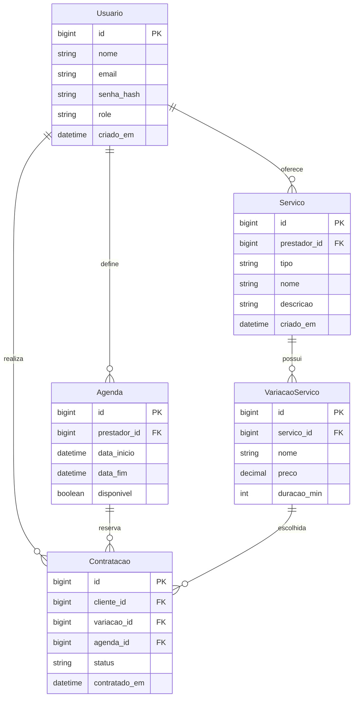

# Etrutura do Backend

```bash
backend/
│
├── prisma/
│   ├── schema.prisma      # modelos do banco
│   └── seed.js            # dados de exemplo
│
├── src/
│   ├── index.js           # ponto de entrada do servidor
│   ├── routes/
│   │   ├── usuarios.js
│   │   ├── servicos.js
│   │   ├── contratacoes.js
│   │   └── agendas.js
│   ├── controllers/       # lógica de negócio
│   │   ├── usuarioController.js
│   │   ├── servicoController.js
│   │   └── contratacaoController.js
│   └── middlewares/       # (auth, validações futuramente)
│
├── package.json
└── Dockerfile
```

# ERD Marketplace

