# Architecture Documentation - Mini Marketplace Services

> Documentação detalhada da arquitetura do sistema de marketplace

## 📋 Índice

- [Visão Geral](#-visão-geral)
- [Arquitetura de Alto Nível](#-arquitetura-de-alto-nível)
- [Componentes do Sistema](#-componentes-do-sistema)
- [Fluxos de Dados](#-fluxos-de-dados)
- [Padrões Arquiteturais](#-padrões-arquiteturais)
- [Decisões Técnicas](#-decisões-técnicas)
- [Escalabilidade](#-escalabilidade)
- [Segurança](#-segurança)
- [Monitoramento](#-monitoramento)

## 🎯 Visão Geral

O Mini Marketplace Services é construído seguindo uma arquitetura de **3 camadas** com separação clara de responsabilidades:

- **Apresentação**: Interface web responsiva (SvelteKit)
- **Aplicação**: API REST para lógica de negócio (Node.js + Express)
- **Dados**: Persistência relacional (PostgreSQL)

### Princípios Arquiteturais

1. **Separação de Responsabilidades**: Cada camada tem uma função específica
2. **Baixo Acoplamento**: Componentes independentes e intercambiáveis
3. **Alta Coesão**: Funcionalidades relacionadas agrupadas
4. **Escalabilidade Horizontal**: Capacidade de adicionar instâncias
5. **Observabilidade**: Logs, métricas e traces para monitoramento

## 🏗 Arquitetura de Alto Nível

### Diagrama C4 - Contexto

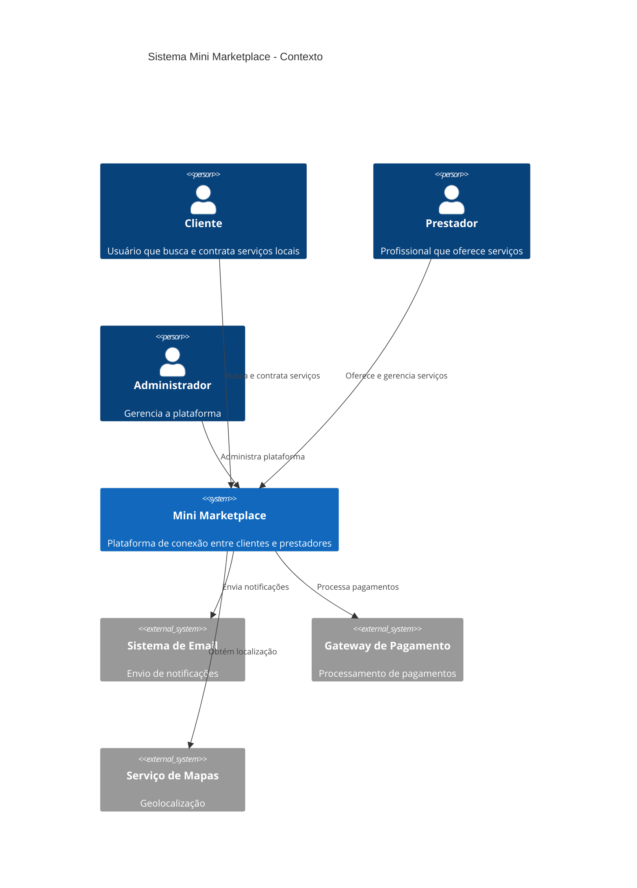

### Diagrama C4 - Container

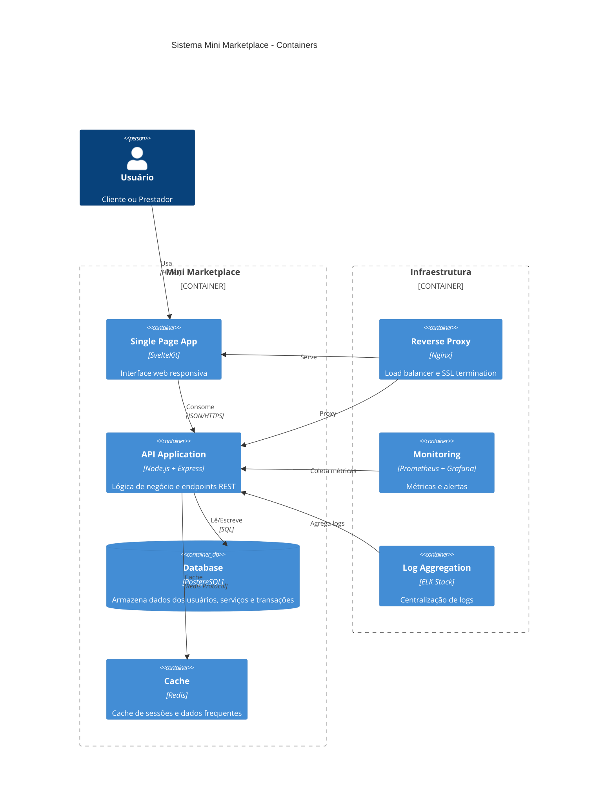

### Diagrama C4 - Componente (API)

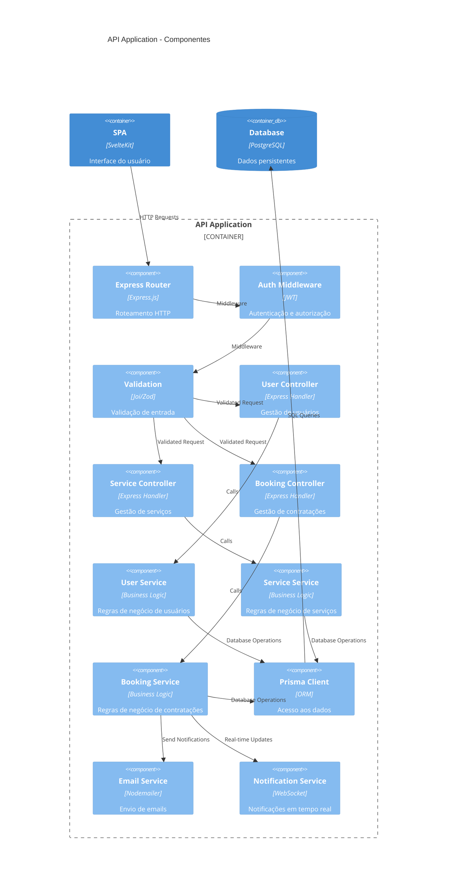

## 🧩 Componentes do Sistema

### Frontend (SvelteKit)

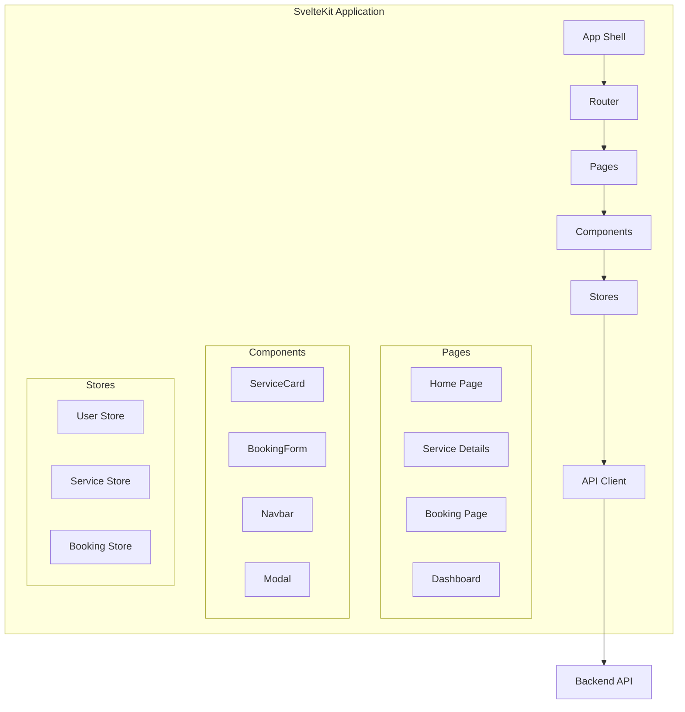

**Responsabilidades:**
- Renderização da interface do usuário
- Gerenciamento de estado local
- Validação de formulários
- Comunicação com API
- Experiência do usuário (UX)

### Backend (Node.js + Express)

```mermaid
graph TB
    subgraph "Express Application"
        A[HTTP Server] --> B[Middleware Stack]
        B --> C[Route Handlers]
        C --> D[Business Logic]
        D --> E[Data Access Layer]
        
        subgraph "Middleware"
            B1[CORS]
            B2[Body Parser]
            B3[Authentication]
            B4[Validation]
            B5[Error Handler]
        end
        
        subgraph "Routes"
            C1[/usuarios]
            C2[/servicos]
            C3[/contratacoes]
            C4[/agendas]
        end
        
        subgraph "Services"
            D1[UserService]
            D2[ServiceService]
            D3[BookingService]
            D4[NotificationService]
        end
    end
    
    E --> F[Prisma ORM]
    F --> G[PostgreSQL]
```

**Responsabilidades:**
- Processamento de requisições HTTP
- Validação e sanitização de dados
- Implementação de regras de negócio
- Gerenciamento de transações
- Integração com serviços externos

### Banco de Dados (PostgreSQL)

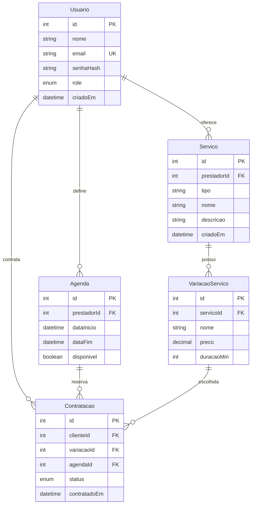

**Responsabilidades:**
- Persistência de dados
- Integridade referencial
- Consultas otimizadas
- Backup e recovery
- Controle de concorrência

## 🔄 Fluxos de Dados

### Fluxo de Contratação de Serviço

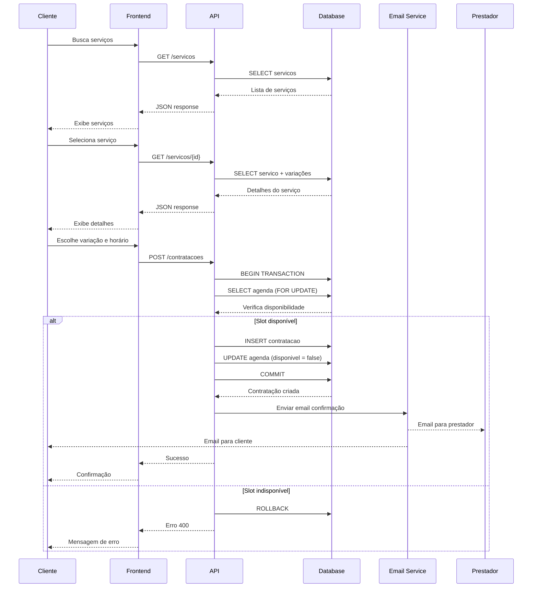

### Fluxo de Cadastro de Serviço

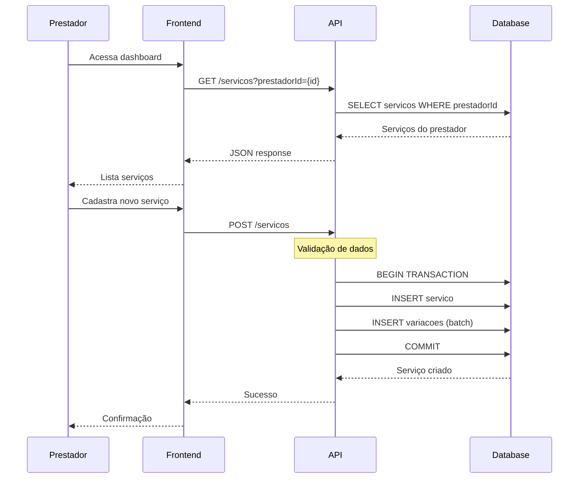

### Fluxo de Autenticação (Futuro)

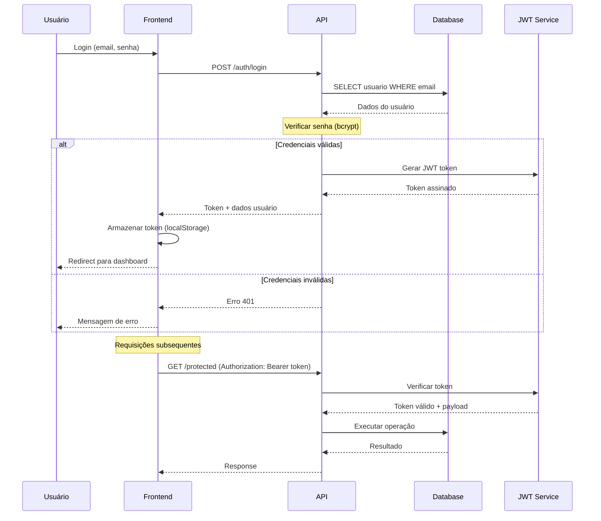

## 🎨 Padrões Arquiteturais

### 1. Model-View-Controller (MVC)

```
Frontend (SvelteKit):
├── View: Componentes Svelte (.svelte)
├── Controller: Stores + Event Handlers
└── Model: API Client + Local State

Backend (Express):
├── Model: Prisma Models + Business Logic
├── View: JSON Responses
└── Controller: Route Handlers
```

### 2. Repository Pattern (via Prisma)

```javascript
// Abstração do acesso a dados
class UserRepository {
  async findById(id) {
    return prisma.usuario.findUnique({ where: { id } });
  }
  
  async create(userData) {
    return prisma.usuario.create({ data: userData });
  }
  
  async findByEmail(email) {
    return prisma.usuario.findUnique({ where: { email } });
  }
}
```

### 3. Service Layer Pattern

```javascript
// Lógica de negócio isolada
class BookingService {
  constructor(userRepo, serviceRepo, agendaRepo, bookingRepo) {
    this.userRepo = userRepo;
    this.serviceRepo = serviceRepo;
    this.agendaRepo = agendaRepo;
    this.bookingRepo = bookingRepo;
  }
  
  async createBooking(clienteId, variacaoId, agendaId) {
    // Validações de negócio
    const cliente = await this.userRepo.findById(clienteId);
    if (!cliente || cliente.role !== 'CLIENTE') {
      throw new Error('Cliente inválido');
    }
    
    // Verificar disponibilidade
    const agenda = await this.agendaRepo.findById(agendaId);
    if (!agenda || !agenda.disponivel) {
      throw new Error('Slot indisponível');
    }
    
    // Criar contratação (transação)
    return this.bookingRepo.createWithTransaction({
      clienteId,
      variacaoId,
      agendaId
    });
  }
}
```

### 4. Middleware Pattern

```javascript
// Pipeline de processamento
app.use(cors());                    // CORS
app.use(express.json());            // Body parsing
app.use(authMiddleware);            // Autenticação
app.use(validationMiddleware);      // Validação
app.use(rateLimitMiddleware);       // Rate limiting
app.use(loggingMiddleware);         // Logging
app.use(errorHandlerMiddleware);    // Error handling
```

### 5. Observer Pattern (Stores)

```javascript
// Estado reativo no frontend
import { writable } from 'svelte/store';

export const services = writable([]);

// Componentes se inscrevem automaticamente
$: filteredServices = $services.filter(s => s.tipo === selectedType);
```

## 🤔 Decisões Técnicas

### Frontend: SvelteKit vs React/Vue

**Escolha**: SvelteKit

**Razões**:
- ✅ Bundle size menor (melhor performance)
- ✅ Sintaxe mais simples e intuitiva
- ✅ Reatividade nativa (sem virtual DOM)
- ✅ SSR/SSG built-in
- ✅ Menor curva de aprendizado

**Trade-offs**:
- ❌ Ecossistema menor que React
- ❌ Menos desenvolvedores no mercado
- ❌ Documentação/tutoriais limitados

### Backend: Node.js vs Python/Java

**Escolha**: Node.js + Express

**Razões**:
- ✅ JavaScript full-stack (mesma linguagem)
- ✅ Ecosystem rico (npm)
- ✅ Performance adequada para I/O intensivo
- ✅ Desenvolvimento rápido
- ✅ JSON nativo

**Trade-offs**:
- ❌ Single-threaded (CPU intensivo)
- ❌ Callback hell (mitigado com async/await)
- ❌ Tipagem dinâmica (mitigado com TypeScript futuro)

### Database: PostgreSQL vs MongoDB

**Escolha**: PostgreSQL

**Razões**:
- ✅ ACID compliance
- ✅ Relacionamentos complexos
- ✅ Queries SQL poderosas
- ✅ Integridade referencial
- ✅ Maturidade e estabilidade

**Trade-offs**:
- ❌ Menos flexível para dados não estruturados
- ❌ Scaling horizontal mais complexo
- ❌ Schema rígido

### ORM: Prisma vs Sequelize/TypeORM

**Escolha**: Prisma

**Razões**:
- ✅ Type-safe queries
- ✅ Schema-first approach
- ✅ Migrations automáticas
- ✅ Prisma Studio (GUI)
- ✅ Performance otimizada

**Trade-offs**:
- ❌ Menos maduro que Sequelize
- ❌ Vendor lock-in
- ❌ Queries complexas limitadas

### Containerização: Docker vs Bare Metal

**Escolha**: Docker + Docker Compose

**Razões**:
- ✅ Ambiente consistente
- ✅ Isolamento de dependências
- ✅ Deploy simplificado
- ✅ Escalabilidade horizontal
- ✅ Desenvolvimento local facilitado

**Trade-offs**:
- ❌ Overhead de performance
- ❌ Complexidade adicional
- ❌ Curva de aprendizado

## 📈 Escalabilidade

### Escalabilidade Horizontal

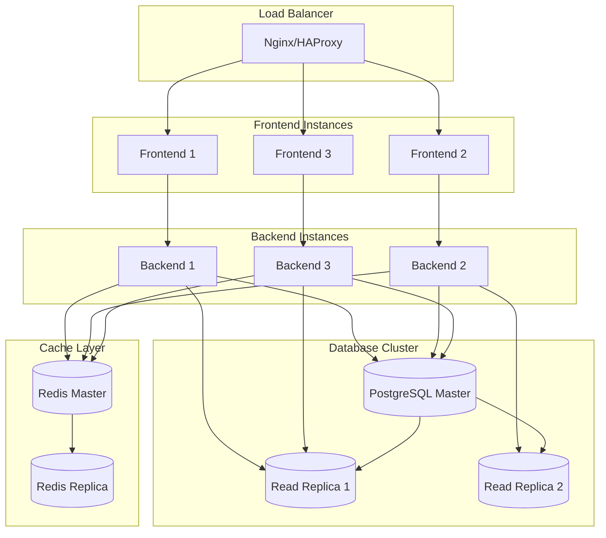

### Estratégias de Scaling

#### 1. Frontend Scaling
```yaml
# docker-compose.scale.yml
services:
  frontend:
    deploy:
      replicas: 3
    environment:
      - NODE_ENV=production
```

#### 2. Backend Scaling
```yaml
services:
  backend:
    deploy:
      replicas: 5
      update_config:
        parallelism: 1
        delay: 10s
```

#### 3. Database Scaling
```sql
-- Read replicas para queries de leitura
-- Master para writes
-- Connection pooling
-- Query optimization
```

#### 4. Cache Strategy
```javascript
// Redis para cache de sessões e dados frequentes
const redis = new Redis({
  host: 'redis-master',
  port: 6379,
  retryDelayOnFailover: 100,
  enableReadyCheck: false,
  maxRetriesPerRequest: null
});

// Cache de serviços populares
async function getPopularServices() {
  const cached = await redis.get('popular_services');
  if (cached) return JSON.parse(cached);
  
  const services = await prisma.servico.findMany({
    // query complexa
  });
  
  await redis.setex('popular_services', 300, JSON.stringify(services));
  return services;
}
```

### Métricas de Performance

| Métrica | Target | Atual | Ação |
|---------|--------|-------|------|
| **Response Time** | < 200ms | 150ms | ✅ OK |
| **Throughput** | > 1000 req/s | 800 req/s | 🔄 Otimizar |
| **Error Rate** | < 0.1% | 0.05% | ✅ OK |
| **Availability** | > 99.9% | 99.95% | ✅ OK |
| **Database Connections** | < 80% | 60% | ✅ OK |

## 🔒 Segurança

### Camadas de Segurança

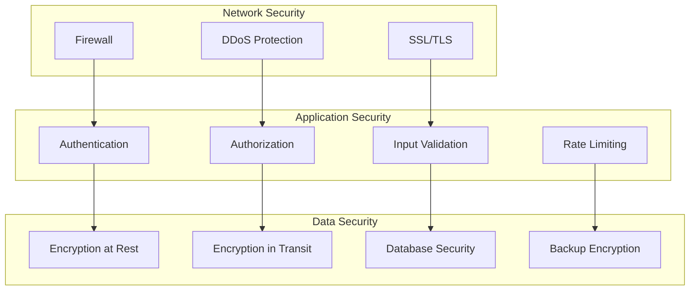

### Implementações de Segurança

#### 1. Autenticação JWT (Planejado)
```javascript
const jwt = require('jsonwebtoken');
const bcrypt = require('bcrypt');

// Gerar token
function generateToken(user) {
  return jwt.sign(
    { 
      id: user.id, 
      email: user.email, 
      role: user.role 
    },
    process.env.JWT_SECRET,
    { expiresIn: '24h' }
  );
}

// Middleware de autenticação
function authenticateToken(req, res, next) {
  const authHeader = req.headers['authorization'];
  const token = authHeader && authHeader.split(' ')[1];
  
  if (!token) {
    return res.sendStatus(401);
  }
  
  jwt.verify(token, process.env.JWT_SECRET, (err, user) => {
    if (err) return res.sendStatus(403);
    req.user = user;
    next();
  });
}
```

#### 2. Validação de Input
```javascript
const Joi = require('joi');

const userSchema = Joi.object({
  nome: Joi.string().min(2).max(100).required(),
  email: Joi.string().email().required(),
  senha: Joi.string().min(8).pattern(/^(?=.*[a-z])(?=.*[A-Z])(?=.*\d)/).required(),
  role: Joi.string().valid('CLIENTE', 'PRESTADOR').required()
});

function validateUser(req, res, next) {
  const { error } = userSchema.validate(req.body);
  if (error) {
    return res.status(400).json({ error: error.details[0].message });
  }
  next();
}
```

#### 3. Rate Limiting
```javascript
const rateLimit = require('express-rate-limit');

const apiLimiter = rateLimit({
  windowMs: 15 * 60 * 1000, // 15 minutos
  max: 100, // máximo 100 requests por IP
  message: 'Muitas requisições, tente novamente em 15 minutos'
});

const authLimiter = rateLimit({
  windowMs: 15 * 60 * 1000,
  max: 5, // máximo 5 tentativas de login
  skipSuccessfulRequests: true
});

app.use('/api/', apiLimiter);
app.use('/auth/login', authLimiter);
```

#### 4. Sanitização de Dados
```javascript
const helmet = require('helmet');
const xss = require('xss');

// Headers de segurança
app.use(helmet());

// Sanitização XSS
function sanitizeInput(req, res, next) {
  if (req.body) {
    for (let key in req.body) {
      if (typeof req.body[key] === 'string') {
        req.body[key] = xss(req.body[key]);
      }
    }
  }
  next();
}
```

### Checklist de Segurança

- [ ] **Autenticação**: JWT implementado
- [ ] **Autorização**: RBAC (Role-Based Access Control)
- [ ] **HTTPS**: SSL/TLS em produção
- [ ] **Headers de Segurança**: Helmet.js configurado
- [ ] **Rate Limiting**: Proteção contra DDoS
- [ ] **Input Validation**: Joi/Zod para validação
- [ ] **SQL Injection**: Prisma ORM (proteção nativa)
- [ ] **XSS Protection**: Sanitização de input
- [ ] **CSRF Protection**: Tokens CSRF
- [ ] **Secrets Management**: Variáveis de ambiente
- [ ] **Audit Logs**: Log de ações sensíveis
- [ ] **Backup Security**: Backups criptografados

## 📊 Monitoramento

### Stack de Observabilidade

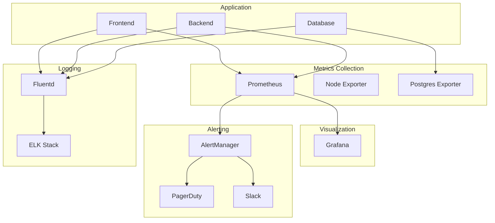

### Métricas Importantes

#### 1. Application Metrics
```javascript
// Prometheus metrics no backend
const promClient = require('prom-client');

const httpRequestDuration = new promClient.Histogram({
  name: 'http_request_duration_seconds',
  help: 'Duration of HTTP requests in seconds',
  labelNames: ['method', 'route', 'status_code']
});

const httpRequestsTotal = new promClient.Counter({
  name: 'http_requests_total',
  help: 'Total number of HTTP requests',
  labelNames: ['method', 'route', 'status_code']
});

// Middleware para coletar métricas
function metricsMiddleware(req, res, next) {
  const start = Date.now();
  
  res.on('finish', () => {
    const duration = (Date.now() - start) / 1000;
    httpRequestDuration
      .labels(req.method, req.route?.path || req.path, res.statusCode)
      .observe(duration);
    
    httpRequestsTotal
      .labels(req.method, req.route?.path || req.path, res.statusCode)
      .inc();
  });
  
  next();
}
```

#### 2. Business Metrics
```javascript
const bookingsTotal = new promClient.Counter({
  name: 'bookings_total',
  help: 'Total number of bookings',
  labelNames: ['status', 'service_type']
});

const revenueTotal = new promClient.Counter({
  name: 'revenue_total',
  help: 'Total revenue in BRL',
  labelNames: ['service_type']
});

// Incrementar métricas de negócio
async function createBooking(bookingData) {
  const booking = await prisma.contratacao.create({ data: bookingData });
  
  bookingsTotal
    .labels(booking.status, booking.variacao.servico.tipo)
    .inc();
  
  revenueTotal
    .labels(booking.variacao.servico.tipo)
    .inc(parseFloat(booking.variacao.preco));
  
  return booking;
}
```

### Dashboards Grafana

#### 1. System Overview
- CPU/Memory/Disk usage
- Network I/O
- Container health
- Database connections

#### 2. Application Performance
- Request rate
- Response time (p50, p95, p99)
- Error rate
- Throughput

#### 3. Business Metrics
- New users per day
- Bookings per hour
- Revenue trends
- Popular services

### Alertas Críticos

```yaml
# alertmanager/alerts.yml
groups:
  - name: minimarketplace
    rules:
      - alert: HighErrorRate
        expr: rate(http_requests_total{status_code=~"5.."}[5m]) > 0.1
        for: 5m
        labels:
          severity: critical
        annotations:
          summary: "High error rate detected"
          
      - alert: DatabaseDown
        expr: up{job="postgres"} == 0
        for: 1m
        labels:
          severity: critical
        annotations:
          summary: "Database is down"
          
      - alert: HighResponseTime
        expr: histogram_quantile(0.95, rate(http_request_duration_seconds_bucket[5m])) > 2
        for: 10m
        labels:
          severity: warning
        annotations:
          summary: "High response time"
```

---

## 🔮 Evolução da Arquitetura

### Roadmap Técnico

#### Fase 1 (Atual) - MVP
- ✅ Arquitetura monolítica simples
- ✅ Docker Compose para desenvolvimento
- ✅ PostgreSQL + Prisma
- ✅ SvelteKit frontend

#### Fase 2 (v1.1) - Produção
- 🔄 Autenticação JWT
- 🔄 Rate limiting
- 🔄 Monitoramento básico
- 🔄 CI/CD pipeline

#### Fase 3 (v1.2) - Escala
- 📋 Load balancer
- 📋 Redis cache
- 📋 Database replicas
- 📋 Horizontal scaling

#### Fase 4 (v2.0) - Microserviços
- 📋 Service decomposition
- 📋 API Gateway
- 📋 Event-driven architecture
- 📋 Kubernetes deployment

### Migração para Microserviços

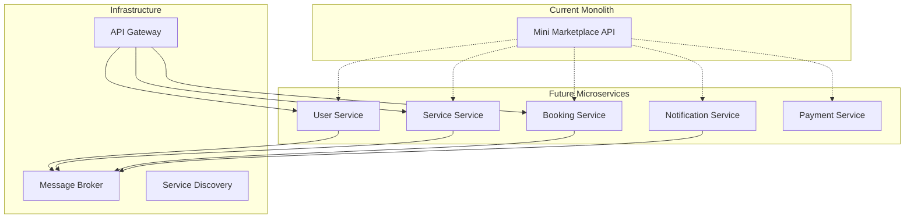

---

## Contato
- E-mail: jvitorbatista29@gmail.com
- [linkedin](https://www.linkedin.com/in/jo%C3%A3o-vitor-batista-silva-50b280279?utm_source=share&utm_campaign=share_via&utm_content=profile&utm_medium=android_app)
- João Vitor Batista Silva