# Database Documentation - Mini Marketplace Services

> Documentação completa do banco de dados PostgreSQL do marketplace

## 📋 Índice

- [Visão Geral](#-visão-geral)
- [Schema do Banco](#-schema-do-banco)
- [Relacionamentos](#-relacionamentos)
- [Índices e Performance](#-índices-e-performance)
- [Migrations](#-migrations)
- [Seeds e Dados Iniciais](#-seeds-e-dados-iniciais)
- [Queries Comuns](#-queries-comuns)
- [Backup e Recovery](#-backup-e-recovery)
- [Monitoramento](#-monitoramento)

## 🎯 Visão Geral

O banco de dados utiliza PostgreSQL 16 com Prisma ORM para gerenciar:

- **Usuários**: Clientes e prestadores de serviços
- **Serviços**: Catálogo de serviços com variações de preço
- **Agendas**: Disponibilidade dos prestadores
- **Contratações**: Sistema de booking e gestão de contratos

### Características Técnicas

- **SGBD**: PostgreSQL 16
- **ORM**: Prisma 6.17.1
- **Encoding**: UTF-8
- **Timezone**: UTC
- **Collation**: pt_BR.UTF-8

## 🗄️ Schema do Banco

### Diagrama ER

```mermaid
erDiagram
    Usuario {
        int id PK
        string nome
        string email UK
        string senhaHash
        enum role "CLIENTE, PRESTADOR"
        datetime criadoEm
    }

    Servico {
        int id PK
        int prestadorId FK
        string tipo
        string nome
        string descricao
        datetime criadoEm
    }

    VariacaoServico {
        int id PK
        int servicoId FK
        string nome
        decimal preco
        int duracaoMin
    }

    Agenda {
        int id PK
        int prestadorId FK
        datetime dataInicio
        datetime dataFim
        boolean disponivel
    }

    Contratacao {
        int id PK
        int clienteId FK
        int variacaoId FK
        int agendaId FK
        enum status "ATIVA, CANCELADA"
        datetime contratadoEm
    }

    Usuario ||--o{ Servico : "prestador oferece"
    Usuario ||--o{ Agenda : "prestador define"
    Usuario ||--o{ Contratacao : "cliente contrata"
    Servico ||--o{ VariacaoServico : "possui variações"
    Agenda ||--o{ Contratacao : "reserva slot"
    VariacaoServico ||--o{ Contratacao : "variação escolhida"
```



### Schema Prisma

```prisma
generator client {
  provider = "prisma-client-js"
}

datasource db {
  provider = "postgresql"
  url      = env("DATABASE_URL")
}

model Usuario {
  id        Int           @id @default(autoincrement())
  nome      String
  email     String        @unique
  senhaHash String
  role      Role
  criadoEm  DateTime      @default(now())
  
  // Relacionamentos
  agendas   Agenda[]      @relation("PrestadorAgendas")
  contratos Contratacao[] @relation("ClienteContratacoes")
  servicos  Servico[]     @relation("PrestadorServicos")
  
  @@map("usuarios")
}

model Servico {
  id          Int               @id @default(autoincrement())
  prestadorId Int
  tipo        String
  nome        String
  descricao   String
  criadoEm    DateTime          @default(now())
  
  // Relacionamentos
  prestador   Usuario           @relation("PrestadorServicos", fields: [prestadorId], references: [id])
  variacoes   VariacaoServico[]
  
  @@map("servicos")
}

model VariacaoServico {
  id         Int           @id @default(autoincrement())
  servicoId  Int
  nome       String
  preco      Decimal       @db.Decimal(10, 2)
  duracaoMin Int
  
  // Relacionamentos
  contratos  Contratacao[]
  servico    Servico       @relation(fields: [servicoId], references: [id])
  
  @@map("variacoes_servico")
}

model Agenda {
  id          Int           @id @default(autoincrement())
  prestadorId Int
  dataInicio  DateTime
  dataFim     DateTime
  disponivel  Boolean       @default(true)
  
  // Relacionamentos
  prestador   Usuario       @relation("PrestadorAgendas", fields: [prestadorId], references: [id])
  contratos   Contratacao[]
  
  @@map("agendas")
}

model Contratacao {
  id           Int             @id @default(autoincrement())
  clienteId    Int
  variacaoId   Int
  agendaId     Int
  status       Status          @default(ATIVA)
  contratadoEm DateTime        @default(now())
  
  // Relacionamentos
  agenda       Agenda          @relation(fields: [agendaId], references: [id])
  cliente      Usuario         @relation("ClienteContratacoes", fields: [clienteId], references: [id])
  variacao     VariacaoServico @relation(fields: [variacaoId], references: [id])
  
  @@map("contratacoes")
}

enum Role {
  CLIENTE
  PRESTADOR
}

enum Status {
  ATIVA
  CANCELADA
}
```

## 🔗 Relacionamentos

### Cardinalidades

| Relacionamento | Cardinalidade | Descrição |
|----------------|---------------|-----------|
| Usuario → Servico | 1:N | Prestador pode ter múltiplos serviços |
| Usuario → Agenda | 1:N | Prestador pode ter múltiplos slots |
| Usuario → Contratacao | 1:N | Cliente pode ter múltiplas contratações |
| Servico → VariacaoServico | 1:N | Serviço pode ter múltiplas variações |
| Agenda → Contratacao | 1:N | Slot pode ter múltiplas contratações (histórico) |
| VariacaoServico → Contratacao | 1:N | Variação pode ser contratada múltiplas vezes |

### Regras de Integridade

```sql
-- Constraints personalizadas (implementadas via Prisma)

-- 1. Email único
ALTER TABLE usuarios ADD CONSTRAINT uk_usuarios_email UNIQUE (email);

-- 2. Preço deve ser positivo
ALTER TABLE variacoes_servico ADD CONSTRAINT ck_preco_positivo 
CHECK (preco > 0);

-- 3. Duração deve ser positiva
ALTER TABLE variacoes_servico ADD CONSTRAINT ck_duracao_positiva 
CHECK (duracao_min > 0);

-- 4. Data fim deve ser maior que data início
ALTER TABLE agendas ADD CONSTRAINT ck_data_valida 
CHECK (data_fim > data_inicio);

-- 5. Prestador não pode contratar próprio serviço
-- (Implementado via lógica de aplicação)
```

## 📈 Índices e Performance

### Índices Automáticos (Prisma)

```sql
-- Chaves primárias (automáticas)
CREATE UNIQUE INDEX usuarios_pkey ON usuarios(id);
CREATE UNIQUE INDEX servicos_pkey ON servicos(id);
CREATE UNIQUE INDEX variacoes_servico_pkey ON variacoes_servico(id);
CREATE UNIQUE INDEX agendas_pkey ON agendas(id);
CREATE UNIQUE INDEX contratacoes_pkey ON contratacoes(id);

-- Chaves estrangeiras (automáticas)
CREATE INDEX servicos_prestador_id_idx ON servicos(prestador_id);
CREATE INDEX variacoes_servico_servico_id_idx ON variacoes_servico(servico_id);
CREATE INDEX agendas_prestador_id_idx ON agendas(prestador_id);
CREATE INDEX contratacoes_cliente_id_idx ON contratacoes(cliente_id);
CREATE INDEX contratacoes_variacao_id_idx ON contratacoes(variacao_id);
CREATE INDEX contratacoes_agenda_id_idx ON contratacoes(agenda_id);

-- Constraints únicos
CREATE UNIQUE INDEX usuarios_email_key ON usuarios(email);
```

### Índices Customizados Recomendados

```sql
-- Busca por tipo de serviço
CREATE INDEX idx_servicos_tipo ON servicos(tipo);

-- Busca por role de usuário
CREATE INDEX idx_usuarios_role ON usuarios(role);

-- Busca por status de contratação
CREATE INDEX idx_contratacoes_status ON contratacoes(status);

-- Busca por disponibilidade de agenda
CREATE INDEX idx_agendas_disponivel ON agendas(disponivel);

-- Busca por data de criação (para relatórios)
CREATE INDEX idx_usuarios_criado_em ON usuarios(criado_em);
CREATE INDEX idx_servicos_criado_em ON servicos(criado_em);
CREATE INDEX idx_contratacoes_contratado_em ON contratacoes(contratado_em);

-- Busca por intervalo de datas na agenda
CREATE INDEX idx_agendas_periodo ON agendas(data_inicio, data_fim);

-- Índice composto para queries comuns
CREATE INDEX idx_contratacoes_cliente_status ON contratacoes(cliente_id, status);
CREATE INDEX idx_servicos_prestador_tipo ON servicos(prestador_id, tipo);
```

### Análise de Performance

```sql
-- Verificar uso de índices
SELECT 
    schemaname,
    tablename,
    indexname,
    idx_scan,
    idx_tup_read,
    idx_tup_fetch
FROM pg_stat_user_indexes
ORDER BY idx_scan DESC;

-- Identificar queries lentas
SELECT 
    query,
    calls,
    total_time,
    mean_time,
    rows
FROM pg_stat_statements
ORDER BY total_time DESC
LIMIT 10;

-- Verificar tamanho das tabelas
SELECT 
    schemaname,
    tablename,
    pg_size_pretty(pg_total_relation_size(schemaname||'.'||tablename)) as size
FROM pg_tables
WHERE schemaname = 'public'
ORDER BY pg_total_relation_size(schemaname||'.'||tablename) DESC;
```

## 🔄 Migrations

### Estrutura de Migrations

```
prisma/migrations/
├── 20241016202142_init/
│   └── migration.sql
├── 20241020150000_add_indexes/
│   └── migration.sql
└── migration_lock.toml
```

### Migration Inicial

```sql
-- CreateEnum
CREATE TYPE "Role" AS ENUM ('CLIENTE', 'PRESTADOR');

-- CreateEnum
CREATE TYPE "Status" AS ENUM ('ATIVA', 'CANCELADA');

-- CreateTable
CREATE TABLE "usuarios" (
    "id" SERIAL NOT NULL,
    "nome" TEXT NOT NULL,
    "email" TEXT NOT NULL,
    "senhaHash" TEXT NOT NULL,
    "role" "Role" NOT NULL,
    "criadoEm" TIMESTAMP(3) NOT NULL DEFAULT CURRENT_TIMESTAMP,

    CONSTRAINT "usuarios_pkey" PRIMARY KEY ("id")
);

-- CreateTable
CREATE TABLE "servicos" (
    "id" SERIAL NOT NULL,
    "prestadorId" INTEGER NOT NULL,
    "tipo" TEXT NOT NULL,
    "nome" TEXT NOT NULL,
    "descricao" TEXT NOT NULL,
    "criadoEm" TIMESTAMP(3) NOT NULL DEFAULT CURRENT_TIMESTAMP,

    CONSTRAINT "servicos_pkey" PRIMARY KEY ("id")
);

-- CreateTable
CREATE TABLE "variacoes_servico" (
    "id" SERIAL NOT NULL,
    "servicoId" INTEGER NOT NULL,
    "nome" TEXT NOT NULL,
    "preco" DECIMAL(10,2) NOT NULL,
    "duracaoMin" INTEGER NOT NULL,

    CONSTRAINT "variacoes_servico_pkey" PRIMARY KEY ("id")
);

-- CreateTable
CREATE TABLE "agendas" (
    "id" SERIAL NOT NULL,
    "prestadorId" INTEGER NOT NULL,
    "dataInicio" TIMESTAMP(3) NOT NULL,
    "dataFim" TIMESTAMP(3) NOT NULL,
    "disponivel" BOOLEAN NOT NULL DEFAULT true,

    CONSTRAINT "agendas_pkey" PRIMARY KEY ("id")
);

-- CreateTable
CREATE TABLE "contratacoes" (
    "id" SERIAL NOT NULL,
    "clienteId" INTEGER NOT NULL,
    "variacaoId" INTEGER NOT NULL,
    "agendaId" INTEGER NOT NULL,
    "status" "Status" NOT NULL DEFAULT 'ATIVA',
    "contratadoEm" TIMESTAMP(3) NOT NULL DEFAULT CURRENT_TIMESTAMP,

    CONSTRAINT "contratacoes_pkey" PRIMARY KEY ("id")
);

-- CreateIndex
CREATE UNIQUE INDEX "usuarios_email_key" ON "usuarios"("email");

-- AddForeignKey
ALTER TABLE "servicos" ADD CONSTRAINT "servicos_prestadorId_fkey" 
FOREIGN KEY ("prestadorId") REFERENCES "usuarios"("id") ON DELETE RESTRICT ON UPDATE CASCADE;

-- AddForeignKey
ALTER TABLE "variacoes_servico" ADD CONSTRAINT "variacoes_servico_servicoId_fkey" 
FOREIGN KEY ("servicoId") REFERENCES "servicos"("id") ON DELETE RESTRICT ON UPDATE CASCADE;

-- AddForeignKey
ALTER TABLE "agendas" ADD CONSTRAINT "agendas_prestadorId_fkey" 
FOREIGN KEY ("prestadorId") REFERENCES "usuarios"("id") ON DELETE RESTRICT ON UPDATE CASCADE;

-- AddForeignKey
ALTER TABLE "contratacoes" ADD CONSTRAINT "contratacoes_clienteId_fkey" 
FOREIGN KEY ("clienteId") REFERENCES "usuarios"("id") ON DELETE RESTRICT ON UPDATE CASCADE;

-- AddForeignKey
ALTER TABLE "contratacoes" ADD CONSTRAINT "contratacoes_variacaoId_fkey" 
FOREIGN KEY ("variacaoId") REFERENCES "variacoes_servico"("id") ON DELETE RESTRICT ON UPDATE CASCADE;

-- AddForeignKey
ALTER TABLE "contratacoes" ADD CONSTRAINT "contratacoes_agendaId_fkey" 
FOREIGN KEY ("agendaId") REFERENCES "agendas"("id") ON DELETE RESTRICT ON UPDATE CASCADE;
```

### Comandos de Migration

```bash
# Gerar nova migration
npx prisma migrate dev --name add_new_feature

# Aplicar migrations em produção
npx prisma migrate deploy

# Reset completo (desenvolvimento)
npx prisma migrate reset

# Verificar status das migrations
npx prisma migrate status

# Resolver conflitos de migration
npx prisma migrate resolve --applied "20241020150000_conflicted_migration"
```

## 🌱 Seeds e Dados Iniciais

### Script de Seed

```javascript
// prisma/seed.js
import { PrismaClient } from "@prisma/client";
const prisma = new PrismaClient();

async function main() {
  console.log("🌱 Iniciando o seed...");

  // Limpar dados existentes
  await prisma.contratacao.deleteMany();
  await prisma.agenda.deleteMany();
  await prisma.variacaoServico.deleteMany();
  await prisma.servico.deleteMany();
  await prisma.usuario.deleteMany();

  // Criar cliente
  const cliente = await prisma.usuario.create({
    data: {
      nome: "João Cliente",
      email: "joao@teste.com",
      senhaHash: "hash456",
      role: "CLIENTE"
    }
  });

  // Criar prestadores com serviços
  const prestadores = [
    {
      nome: "Maria das Dores",
      email: "maria@teste.com",
      senhaHash: "hash123",
      tipo: "Manicure",
      servicoNome: "Serviço de manicure profissional",
      servicoDescricao: "Profissional com 20 anos de experiência",
      variacoes: [
        { nome: "Pé", preco: "20.00", duracaoMin: 30 },
        { nome: "Mão com pintura", preco: "35.00", duracaoMin: 60 }
      ]
    },
    {
      nome: "Carlos Eletricista",
      email: "carlos@teste.com",
      senhaHash: "hash789",
      tipo: "Eletricista",
      servicoNome: "Serviços elétricos residenciais",
      servicoDescricao: "Instalações, reparos e manutenção elétrica",
      variacoes: [
        { nome: "Instalação de tomada", preco: "50.00", duracaoMin: 45 },
        { nome: "Reparo de curto-circuito", preco: "80.00", duracaoMin: 60 },
        { nome: "Troca de disjuntor", preco: "120.00", duracaoMin: 90 }
      ]
    }
  ];

  for (const p of prestadores) {
    const prestador = await prisma.usuario.create({
      data: {
        nome: p.nome,
        email: p.email,
        senhaHash: p.senhaHash,
        role: "PRESTADOR",
        servicos: {
          create: {
            tipo: p.tipo,
            nome: p.servicoNome,
            descricao: p.servicoDescricao,
            variacoes: {
              create: p.variacoes
            }
          }
        }
      },
      include: {
        servicos: {
          include: {
            variacoes: true
          }
        }
      }
    });

    // Criar agenda para o prestador
    const hoje = new Date();
    for (let i = 1; i <= 7; i++) {
      const data = new Date(hoje);
      data.setDate(hoje.getDate() + i);
      
      // Criar slots de 1 hora das 9h às 17h
      for (let hora = 9; hora < 17; hora++) {
        const inicio = new Date(data);
        inicio.setHours(hora, 0, 0, 0);
        
        const fim = new Date(inicio);
        fim.setHours(hora + 1, 0, 0, 0);
        
        await prisma.agenda.create({
          data: {
            prestadorId: prestador.id,
            dataInicio: inicio,
            dataFim: fim,
            disponivel: true
          }
        });
      }
    }

    console.log(`✅ Prestador criado: ${prestador.nome}`);
  }

  console.log("✅ Seed concluído com sucesso!");
}

main()
  .catch((e) => {
    console.error("❌ Erro no seed:", e);
    process.exit(1);
  })
  .finally(async () => {
    await prisma.$disconnect();
  });
```

### Executar Seed

```bash
# Executar seed
npx prisma db seed

# Configurar no package.json
{
  "prisma": {
    "seed": "node prisma/seed.js"
  }
}
```

## 🔍 Queries Comuns

### Consultas de Negócio

```sql
-- 1. Listar serviços com prestador e variações
SELECT 
    s.id,
    s.nome as servico_nome,
    s.tipo,
    s.descricao,
    u.nome as prestador_nome,
    u.email as prestador_email,
    vs.nome as variacao_nome,
    vs.preco,
    vs.duracao_min
FROM servicos s
JOIN usuarios u ON s.prestador_id = u.id
JOIN variacoes_servico vs ON vs.servico_id = s.id
WHERE u.role = 'PRESTADOR'
ORDER BY s.tipo, s.nome, vs.preco;

-- 2. Buscar agenda disponível por prestador
SELECT 
    a.id,
    a.data_inicio,
    a.data_fim,
    u.nome as prestador_nome
FROM agendas a
JOIN usuarios u ON a.prestador_id = u.id
WHERE a.disponivel = true
  AND a.data_inicio > NOW()
  AND u.id = $1
ORDER BY a.data_inicio;

-- 3. Histórico de contratações do cliente
SELECT 
    c.id,
    c.status,
    c.contratado_em,
    vs.nome as variacao_nome,
    vs.preco,
    s.nome as servico_nome,
    u.nome as prestador_nome,
    a.data_inicio,
    a.data_fim
FROM contratacoes c
JOIN variacoes_servico vs ON c.variacao_id = vs.id
JOIN servicos s ON vs.servico_id = s.id
JOIN usuarios u ON s.prestador_id = u.id
JOIN agendas a ON c.agenda_id = a.id
WHERE c.cliente_id = $1
ORDER BY c.contratado_em DESC;

-- 4. Relatório de faturamento por prestador
SELECT 
    u.nome as prestador_nome,
    COUNT(c.id) as total_contratacoes,
    SUM(vs.preco) as faturamento_total,
    AVG(vs.preco) as ticket_medio
FROM usuarios u
JOIN servicos s ON u.id = s.prestador_id
JOIN variacoes_servico vs ON s.id = vs.servico_id
JOIN contratacoes c ON vs.id = c.variacao_id
WHERE u.role = 'PRESTADOR'
  AND c.status = 'ATIVA'
  AND c.contratado_em >= $1  -- data_inicio
  AND c.contratado_em <= $2  -- data_fim
GROUP BY u.id, u.nome
ORDER BY faturamento_total DESC;

-- 5. Serviços mais populares
SELECT 
    s.nome as servico_nome,
    s.tipo,
    COUNT(c.id) as total_contratacoes,
    AVG(vs.preco) as preco_medio
FROM servicos s
JOIN variacoes_servico vs ON s.id = vs.servico_id
JOIN contratacoes c ON vs.id = c.variacao_id
WHERE c.status = 'ATIVA'
GROUP BY s.id, s.nome, s.tipo
ORDER BY total_contratacoes DESC
LIMIT 10;
```

### Queries de Performance

```sql
-- 6. Verificar slots disponíveis em período
SELECT 
    a.id,
    a.data_inicio,
    a.data_fim,
    u.nome as prestador_nome,
    s.nome as servico_nome
FROM agendas a
JOIN usuarios u ON a.prestador_id = u.id
JOIN servicos s ON u.id = s.prestador_id
WHERE a.disponivel = true
  AND a.data_inicio BETWEEN $1 AND $2  -- período desejado
  AND s.tipo = $3  -- tipo de serviço
ORDER BY a.data_inicio;

-- 7. Estatísticas gerais do sistema
SELECT 
    (SELECT COUNT(*) FROM usuarios WHERE role = 'CLIENTE') as total_clientes,
    (SELECT COUNT(*) FROM usuarios WHERE role = 'PRESTADOR') as total_prestadores,
    (SELECT COUNT(*) FROM servicos) as total_servicos,
    (SELECT COUNT(*) FROM contratacoes WHERE status = 'ATIVA') as contratacoes_ativas,
    (SELECT COUNT(*) FROM agendas WHERE disponivel = true AND data_inicio > NOW()) as slots_disponiveis;

-- 8. Prestadores mais ativos (com mais slots disponíveis)
SELECT 
    u.nome,
    u.email,
    COUNT(a.id) as slots_disponiveis,
    COUNT(DISTINCT s.id) as total_servicos
FROM usuarios u
JOIN agendas a ON u.id = a.prestador_id
JOIN servicos s ON u.id = s.prestador_id
WHERE u.role = 'PRESTADOR'
  AND a.disponivel = true
  AND a.data_inicio > NOW()
GROUP BY u.id, u.nome, u.email
ORDER BY slots_disponiveis DESC;
```

### Views Úteis

```sql
-- View: Serviços com informações completas
CREATE VIEW vw_servicos_completos AS
SELECT 
    s.id as servico_id,
    s.nome as servico_nome,
    s.tipo,
    s.descricao,
    s.criado_em,
    u.id as prestador_id,
    u.nome as prestador_nome,
    u.email as prestador_email,
    vs.id as variacao_id,
    vs.nome as variacao_nome,
    vs.preco,
    vs.duracao_min
FROM servicos s
JOIN usuarios u ON s.prestador_id = u.id
JOIN variacoes_servico vs ON s.id = vs.servico_id
WHERE u.role = 'PRESTADOR';

-- View: Agenda disponível
CREATE VIEW vw_agenda_disponivel AS
SELECT 
    a.id as agenda_id,
    a.data_inicio,
    a.data_fim,
    u.id as prestador_id,
    u.nome as prestador_nome,
    s.tipo as servico_tipo
FROM agendas a
JOIN usuarios u ON a.prestador_id = u.id
JOIN servicos s ON u.id = s.prestador_id
WHERE a.disponivel = true
  AND a.data_inicio > NOW();

-- View: Relatório de contratações
CREATE VIEW vw_contratacoes_detalhadas AS
SELECT 
    c.id as contratacao_id,
    c.status,
    c.contratado_em,
    cli.nome as cliente_nome,
    cli.email as cliente_email,
    prest.nome as prestador_nome,
    prest.email as prestador_email,
    s.nome as servico_nome,
    s.tipo as servico_tipo,
    vs.nome as variacao_nome,
    vs.preco,
    vs.duracao_min,
    a.data_inicio,
    a.data_fim
FROM contratacoes c
JOIN usuarios cli ON c.cliente_id = cli.id
JOIN variacoes_servico vs ON c.variacao_id = vs.id
JOIN servicos s ON vs.servico_id = s.id
JOIN usuarios prest ON s.prestador_id = prest.id
JOIN agendas a ON c.agenda_id = a.id;
```

## 💾 Backup e Recovery

### Backup Automático

```bash
#!/bin/bash
# scripts/backup-db.sh

DB_NAME="marketplace"
DB_USER="admin"
BACKUP_DIR="/opt/backups/database"
DATE=$(date +%Y%m%d_%H%M%S)

# Criar diretório se não existir
mkdir -p $BACKUP_DIR

# Backup completo
docker exec minimarketplace_db_1 pg_dump -U $DB_USER -d $DB_NAME | gzip > $BACKUP_DIR/full_backup_$DATE.sql.gz

# Backup apenas do schema
docker exec minimarketplace_db_1 pg_dump -U $DB_USER -d $DB_NAME --schema-only > $BACKUP_DIR/schema_backup_$DATE.sql

# Backup apenas dos dados
docker exec minimarketplace_db_1 pg_dump -U $DB_USER -d $DB_NAME --data-only | gzip > $BACKUP_DIR/data_backup_$DATE.sql.gz

echo "Backup concluído: $DATE"
```

### Restore

```bash
#!/bin/bash
# scripts/restore-db.sh

BACKUP_FILE=$1
DB_NAME="marketplace"
DB_USER="admin"

if [ -z "$BACKUP_FILE" ]; then
    echo "Uso: $0 <backup_file>"
    exit 1
fi

# Parar aplicação
docker-compose stop backend frontend

# Restaurar backup
if [[ $BACKUP_FILE == *.gz ]]; then
    zcat $BACKUP_FILE | docker exec -i minimarketplace_db_1 psql -U $DB_USER -d $DB_NAME
else
    cat $BACKUP_FILE | docker exec -i minimarketplace_db_1 psql -U $DB_USER -d $DB_NAME
fi

# Reiniciar aplicação
docker-compose start backend frontend

echo "Restore concluído"
```

## 📊 Monitoramento

### Métricas Importantes

```sql
-- Conexões ativas
SELECT 
    count(*) as active_connections,
    state
FROM pg_stat_activity 
WHERE datname = 'marketplace'
GROUP BY state;

-- Tamanho do banco
SELECT 
    pg_size_pretty(pg_database_size('marketplace')) as database_size;

-- Tabelas maiores
SELECT 
    schemaname,
    tablename,
    pg_size_pretty(pg_total_relation_size(schemaname||'.'||tablename)) as size,
    pg_total_relation_size(schemaname||'.'||tablename) as size_bytes
FROM pg_tables 
WHERE schemaname = 'public'
ORDER BY size_bytes DESC;

-- Queries mais lentas
SELECT 
    query,
    calls,
    total_time,
    mean_time,
    rows
FROM pg_stat_statements 
ORDER BY total_time DESC 
LIMIT 10;

-- Índices não utilizados
SELECT 
    schemaname,
    tablename,
    indexname,
    idx_scan
FROM pg_stat_user_indexes 
WHERE idx_scan = 0
ORDER BY schemaname, tablename;
```

### Alertas Recomendados

```sql
-- Conexões próximas do limite
SELECT 
    count(*) as current_connections,
    setting::int as max_connections,
    round(count(*)::numeric / setting::numeric * 100, 2) as usage_percent
FROM pg_stat_activity, pg_settings 
WHERE name = 'max_connections';

-- Transações longas
SELECT 
    pid,
    now() - pg_stat_activity.query_start AS duration,
    query 
FROM pg_stat_activity 
WHERE (now() - pg_stat_activity.query_start) > interval '5 minutes'
  AND state = 'active';

-- Locks bloqueantes
SELECT 
    blocked_locks.pid AS blocked_pid,
    blocked_activity.usename AS blocked_user,
    blocking_locks.pid AS blocking_pid,
    blocking_activity.usename AS blocking_user,
    blocked_activity.query AS blocked_statement,
    blocking_activity.query AS current_statement_in_blocking_process
FROM pg_catalog.pg_locks blocked_locks
JOIN pg_catalog.pg_stat_activity blocked_activity ON blocked_activity.pid = blocked_locks.pid
JOIN pg_catalog.pg_locks blocking_locks ON blocking_locks.locktype = blocked_locks.locktype
JOIN pg_catalog.pg_stat_activity blocking_activity ON blocking_activity.pid = blocking_locks.pid
WHERE NOT blocked_locks.granted;
```

---

## 🔧 Manutenção

### Rotinas de Manutenção

```sql
-- Vacuum e analyze automático (configurar no postgresql.conf)
-- autovacuum = on
-- autovacuum_analyze_scale_factor = 0.1
-- autovacuum_vacuum_scale_factor = 0.2

-- Vacuum manual quando necessário
VACUUM ANALYZE usuarios;
VACUUM ANALYZE servicos;
VACUUM ANALYZE contratacoes;

-- Reindex quando necessário
REINDEX TABLE usuarios;
REINDEX TABLE servicos;

-- Atualizar estatísticas
ANALYZE;
```

### Limpeza de Dados

```sql
-- Limpar contratações canceladas antigas (> 1 ano)
DELETE FROM contratacoes 
WHERE status = 'CANCELADA' 
  AND contratado_em < NOW() - INTERVAL '1 year';

-- Limpar agenda passada não utilizada
DELETE FROM agendas 
WHERE disponivel = true 
  AND data_fim < NOW() - INTERVAL '30 days';

-- Arquivar dados antigos (exemplo)
CREATE TABLE contratacoes_arquivo AS 
SELECT * FROM contratacoes 
WHERE contratado_em < NOW() - INTERVAL '2 years';

DELETE FROM contratacoes 
WHERE contratado_em < NOW() - INTERVAL '2 years';
```

---

## 📞 Suporte

### Comandos Úteis

```bash
# Conectar ao banco
docker-compose exec db psql -U admin -d marketplace

# Ver logs do PostgreSQL
docker-compose logs -f db

# Verificar status do banco
docker-compose exec db pg_isready -U admin

# Executar query via linha de comando
docker-compose exec db psql -U admin -d marketplace -c "SELECT COUNT(*) FROM usuarios;"
```

### Troubleshooting

| Problema | Solução |
|----------|---------|
| **Conexão recusada** | Verificar se container está rodando |
| **Queries lentas** | Analisar com EXPLAIN ANALYZE |
| **Locks** | Identificar transações longas |
| **Espaço em disco** | Executar VACUUM FULL |
| **Corrupção** | Restaurar do backup mais recente |