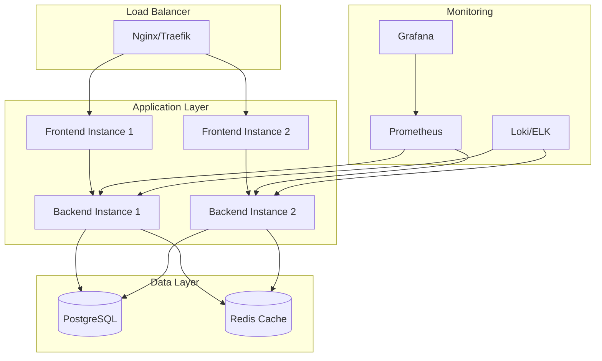
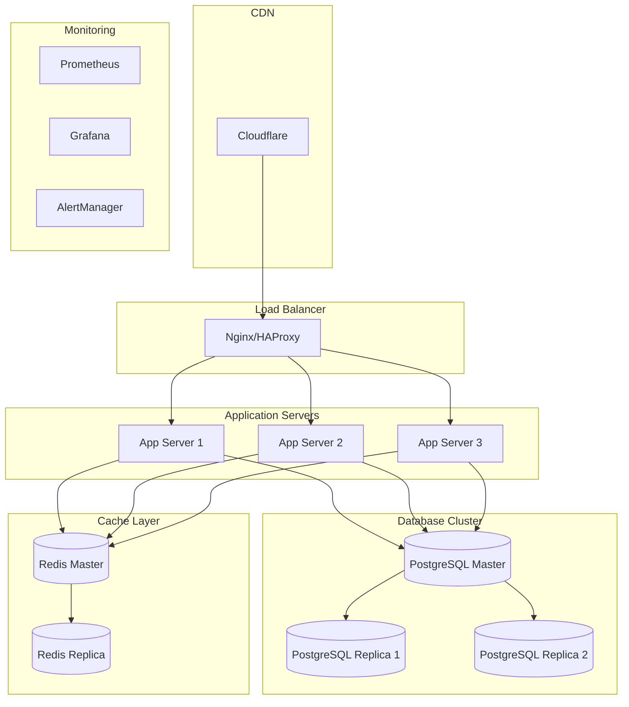

# Deployment Guide - Mini Marketplace Services

> Guia completo para deploy do marketplace de serviços em diferentes ambientes

## 📋 Índice

- [Visão Geral](#-visão-geral)
- [Pré-requisitos](#-pré-requisitos)
- [Deploy Local](#-deploy-local)
- [Deploy em Staging](#-deploy-em-staging)
- [Deploy em Produção](#-deploy-em-produção)
- [Monitoramento](#-monitoramento)
- [Backup e Recovery](#-backup-e-recovery)
- [Troubleshooting](#-troubleshooting)

## 🎯 Visão Geral

O Mini Marketplace Services pode ser deployado em diferentes ambientes:

- **Local**: Desenvolvimento com Docker Compose
- **Staging**: Ambiente de testes em servidor
- **Produção**: Deploy escalável com orquestração

### Arquitetura de Deploy



## 📋 Pré-requisitos

### Servidor Mínimo

| Componente | Desenvolvimento | Staging | Produção |
|------------|----------------|---------|----------|
| **CPU** | 2 cores | 4 cores | 8+ cores |
| **RAM** | 4GB | 8GB | 16+ GB |
| **Storage** | 20GB | 50GB | 100+ GB |
| **Network** | 100Mbps | 1Gbps | 1Gbps+ |

### Software Necessário

```bash
# Docker & Docker Compose
curl -fsSL https://get.docker.com -o get-docker.sh
sh get-docker.sh
sudo usermod -aG docker $USER

# Docker Compose
sudo curl -L "https://github.com/docker/compose/releases/latest/download/docker-compose-$(uname -s)-$(uname -m)" -o /usr/local/bin/docker-compose
sudo chmod +x /usr/local/bin/docker-compose

# Git
sudo apt update && sudo apt install -y git

# Nginx (para proxy reverso)
sudo apt install -y nginx

# Certbot (para SSL)
sudo apt install -y certbot python3-certbot-nginx
```

## 🏠 Deploy Local

### Desenvolvimento Rápido

```bash
# 1. Clone do repositório
git clone <repository-url>
cd mini-marketplace-services

# 2. Configurar variáveis de ambiente
cp .env.example .env
# Editar .env conforme necessário

# 3. Executar com Docker Compose
docker-compose up -d

# 4. Verificar status
docker-compose ps
docker-compose logs -f
```

### Configuração de Desenvolvimento

```yaml
# docker-compose.override.yml
version: "3.9"
services:
  backend:
    volumes:
      - ./backend:/backend:cached
    environment:
      - NODE_ENV=development
    command: sh -c "npm install && npm run dev"
  
  frontend:
    volumes:
      - ./frontend:/frontend:cached
    environment:
      - NODE_ENV=development
    command: sh -c "npm install && npm run dev -- --host"
```

### Scripts de Desenvolvimento

```bash
#!/bin/bash
# scripts/dev-setup.sh

echo "🚀 Configurando ambiente de desenvolvimento..."

# Verificar Docker
if ! command -v docker &> /dev/null; then
    echo "❌ Docker não encontrado. Instale o Docker primeiro."
    exit 1
fi

# Criar rede Docker
docker network create marketplace-network 2>/dev/null || true

# Configurar variáveis de ambiente
if [ ! -f .env ]; then
    cp .env.example .env
    echo "📝 Arquivo .env criado. Configure as variáveis necessárias."
fi

# Executar aplicação
docker-compose up -d

echo "✅ Ambiente configurado!"
echo "🌐 Frontend: http://localhost:5173"
echo "🔧 Backend: http://localhost:3000"
echo "🗄️ Database: localhost:5433"
```

## 🧪 Deploy em Staging

### Configuração do Servidor

```bash
# 1. Preparar servidor
sudo apt update && sudo apt upgrade -y
sudo apt install -y docker.io docker-compose nginx certbot

# 2. Configurar usuário
sudo usermod -aG docker $USER
newgrp docker

# 3. Configurar firewall
sudo ufw allow ssh
sudo ufw allow 80
sudo ufw allow 443
sudo ufw enable
```

### Docker Compose para Staging

```yaml
# docker-compose.staging.yml
version: "3.9"

services:
  db:
    image: postgres:16
    restart: unless-stopped
    environment:
      POSTGRES_USER: ${DB_USER}
      POSTGRES_PASSWORD: ${DB_PASSWORD}
      POSTGRES_DB: ${DB_NAME}
    volumes:
      - db_data:/var/lib/postgresql/data
    networks:
      - marketplace-network

  backend:
    build: 
      context: ./backend
      dockerfile: Dockerfile.staging
    restart: unless-stopped
    depends_on:
      - db
    environment:
      DATABASE_URL: postgresql://${DB_USER}:${DB_PASSWORD}@db:5432/${DB_NAME}
      NODE_ENV: staging
      PORT: 3000
    networks:
      - marketplace-network
    labels:
      - "traefik.enable=true"
      - "traefik.http.routers.backend.rule=Host(`api-staging.minimarketplace.com`)"
      - "traefik.http.routers.backend.tls.certresolver=letsencrypt"

  frontend:
    build:
      context: ./frontend
      dockerfile: Dockerfile.staging
    restart: unless-stopped
    depends_on:
      - backend
    environment:
      VITE_API_BASE: https://api-staging.minimarketplace.com
    networks:
      - marketplace-network
    labels:
      - "traefik.enable=true"
      - "traefik.http.routers.frontend.rule=Host(`staging.minimarketplace.com`)"
      - "traefik.http.routers.frontend.tls.certresolver=letsencrypt"

  traefik:
    image: traefik:v2.10
    restart: unless-stopped
    ports:
      - "80:80"
      - "443:443"
    volumes:
      - /var/run/docker.sock:/var/run/docker.sock:ro
      - ./traefik:/etc/traefik
      - traefik_certs:/certs
    networks:
      - marketplace-network

volumes:
  db_data:
  traefik_certs:

networks:
  marketplace-network:
    external: true
```

### Configuração do Traefik

```yaml
# traefik/traefik.yml
api:
  dashboard: true
  insecure: false

entryPoints:
  web:
    address: ":80"
    http:
      redirections:
        entrypoint:
          to: websecure
          scheme: https
  websecure:
    address: ":443"

providers:
  docker:
    exposedByDefault: false

certificatesResolvers:
  letsencrypt:
    acme:
      email: admin@minimarketplace.com
      storage: /certs/acme.json
      httpChallenge:
        entryPoint: web
```

### Script de Deploy Staging

```bash
#!/bin/bash
# scripts/deploy-staging.sh

set -e

echo "🚀 Iniciando deploy em staging..."

# Variáveis
REPO_URL="https://github.com/user/mini-marketplace-services.git"
DEPLOY_DIR="/opt/mini-marketplace"
BRANCH="develop"

# Backup do banco atual
echo "💾 Fazendo backup do banco..."
docker-compose -f docker-compose.staging.yml exec -T db pg_dump -U $DB_USER $DB_NAME > backup_$(date +%Y%m%d_%H%M%S).sql

# Atualizar código
echo "📥 Atualizando código..."
cd $DEPLOY_DIR
git fetch origin
git checkout $BRANCH
git pull origin $BRANCH

# Build e deploy
echo "🔨 Fazendo build das imagens..."
docker-compose -f docker-compose.staging.yml build --no-cache

echo "🔄 Atualizando serviços..."
docker-compose -f docker-compose.staging.yml up -d

# Verificar saúde dos serviços
echo "🏥 Verificando saúde dos serviços..."
sleep 30

if curl -f http://localhost:3000/ > /dev/null 2>&1; then
    echo "✅ Backend está funcionando"
else
    echo "❌ Backend não está respondendo"
    exit 1
fi

if curl -f http://localhost:5173/ > /dev/null 2>&1; then
    echo "✅ Frontend está funcionando"
else
    echo "❌ Frontend não está respondendo"
    exit 1
fi

echo "🎉 Deploy em staging concluído com sucesso!"
```

## 🚀 Deploy em Produção

### Arquitetura de Produção



### Docker Swarm Configuration

```yaml
# docker-compose.prod.yml
version: "3.9"

services:
  db:
    image: postgres:16
    deploy:
      replicas: 1
      placement:
        constraints:
          - node.role == manager
      restart_policy:
        condition: on-failure
        delay: 5s
        max_attempts: 3
    environment:
      POSTGRES_USER_FILE: /run/secrets/db_user
      POSTGRES_PASSWORD_FILE: /run/secrets/db_password
      POSTGRES_DB: marketplace
    volumes:
      - db_data:/var/lib/postgresql/data
    networks:
      - marketplace-network
    secrets:
      - db_user
      - db_password

  backend:
    image: minimarketplace/backend:${VERSION}
    deploy:
      replicas: 3
      update_config:
        parallelism: 1
        delay: 10s
        failure_action: rollback
      restart_policy:
        condition: on-failure
        delay: 5s
        max_attempts: 3
    environment:
      DATABASE_URL_FILE: /run/secrets/database_url
      NODE_ENV: production
      PORT: 3000
    networks:
      - marketplace-network
    secrets:
      - database_url
    healthcheck:
      test: ["CMD", "curl", "-f", "http://localhost:3000/"]
      interval: 30s
      timeout: 10s
      retries: 3

  frontend:
    image: minimarketplace/frontend:${VERSION}
    deploy:
      replicas: 2
      update_config:
        parallelism: 1
        delay: 10s
      restart_policy:
        condition: on-failure
    environment:
      VITE_API_BASE: https://api.minimarketplace.com
    networks:
      - marketplace-network

  nginx:
    image: nginx:alpine
    deploy:
      replicas: 2
      placement:
        constraints:
          - node.role == manager
    ports:
      - "80:80"
      - "443:443"
    volumes:
      - ./nginx/nginx.conf:/etc/nginx/nginx.conf:ro
      - ./nginx/ssl:/etc/nginx/ssl:ro
    networks:
      - marketplace-network
    depends_on:
      - backend
      - frontend

secrets:
  db_user:
    external: true
  db_password:
    external: true
  database_url:
    external: true

volumes:
  db_data:

networks:
  marketplace-network:
    driver: overlay
    attachable: true
```

### Configuração do Nginx

```nginx
# nginx/nginx.conf
upstream backend {
    least_conn;
    server backend:3000 max_fails=3 fail_timeout=30s;
}

upstream frontend {
    least_conn;
    server frontend:5173 max_fails=3 fail_timeout=30s;
}

# Rate limiting
limit_req_zone $binary_remote_addr zone=api:10m rate=10r/s;
limit_req_zone $binary_remote_addr zone=web:10m rate=30r/s;

server {
    listen 80;
    server_name minimarketplace.com www.minimarketplace.com;
    return 301 https://$server_name$request_uri;
}

server {
    listen 443 ssl http2;
    server_name minimarketplace.com www.minimarketplace.com;

    # SSL Configuration
    ssl_certificate /etc/nginx/ssl/minimarketplace.com.crt;
    ssl_certificate_key /etc/nginx/ssl/minimarketplace.com.key;
    ssl_protocols TLSv1.2 TLSv1.3;
    ssl_ciphers ECDHE-RSA-AES256-GCM-SHA512:DHE-RSA-AES256-GCM-SHA512;
    ssl_prefer_server_ciphers off;

    # Security Headers
    add_header X-Frame-Options DENY;
    add_header X-Content-Type-Options nosniff;
    add_header X-XSS-Protection "1; mode=block";
    add_header Strict-Transport-Security "max-age=63072000; includeSubDomains; preload";

    # Frontend
    location / {
        limit_req zone=web burst=20 nodelay;
        proxy_pass http://frontend;
        proxy_set_header Host $host;
        proxy_set_header X-Real-IP $remote_addr;
        proxy_set_header X-Forwarded-For $proxy_add_x_forwarded_for;
        proxy_set_header X-Forwarded-Proto $scheme;
    }

    # API
    location /api/ {
        limit_req zone=api burst=10 nodelay;
        proxy_pass http://backend/;
        proxy_set_header Host $host;
        proxy_set_header X-Real-IP $remote_addr;
        proxy_set_header X-Forwarded-For $proxy_add_x_forwarded_for;
        proxy_set_header X-Forwarded-Proto $scheme;
        
        # CORS
        add_header Access-Control-Allow-Origin "https://minimarketplace.com";
        add_header Access-Control-Allow-Methods "GET, POST, PUT, DELETE, OPTIONS";
        add_header Access-Control-Allow-Headers "Authorization, Content-Type";
    }

    # Health check
    location /health {
        access_log off;
        return 200 "healthy\n";
        add_header Content-Type text/plain;
    }
}
```

### Script de Deploy Produção

```bash
#!/bin/bash
# scripts/deploy-production.sh

set -e

echo "🚀 Iniciando deploy em produção..."

# Variáveis
VERSION=${1:-latest}
STACK_NAME="minimarketplace"

# Verificações de segurança
if [ "$NODE_ENV" != "production" ]; then
    echo "❌ NODE_ENV deve ser 'production'"
    exit 1
fi

# Backup completo
echo "💾 Fazendo backup completo..."
./scripts/backup-production.sh

# Build das imagens
echo "🔨 Fazendo build das imagens..."
docker build -t minimarketplace/backend:$VERSION ./backend
docker build -t minimarketplace/frontend:$VERSION ./frontend

# Push para registry
echo "📤 Enviando imagens para registry..."
docker push minimarketplace/backend:$VERSION
docker push minimarketplace/frontend:$VERSION

# Deploy no Swarm
echo "🔄 Fazendo deploy no Docker Swarm..."
VERSION=$VERSION docker stack deploy -c docker-compose.prod.yml $STACK_NAME

# Aguardar estabilização
echo "⏳ Aguardando estabilização dos serviços..."
sleep 60

# Verificar saúde
echo "🏥 Verificando saúde dos serviços..."
if ! curl -f https://minimarketplace.com/health > /dev/null 2>&1; then
    echo "❌ Health check falhou. Fazendo rollback..."
    docker stack rollback $STACK_NAME
    exit 1
fi

# Smoke tests
echo "🧪 Executando smoke tests..."
./scripts/smoke-tests.sh

echo "🎉 Deploy em produção concluído com sucesso!"
echo "🌐 Site: https://minimarketplace.com"
echo "🔧 API: https://api.minimarketplace.com"
```

## 📊 Monitoramento

### Prometheus Configuration

```yaml
# monitoring/prometheus.yml
global:
  scrape_interval: 15s
  evaluation_interval: 15s

rule_files:
  - "alert_rules.yml"

scrape_configs:
  - job_name: 'backend'
    static_configs:
      - targets: ['backend:3000']
    metrics_path: '/metrics'
    scrape_interval: 30s

  - job_name: 'postgres'
    static_configs:
      - targets: ['postgres-exporter:9187']

  - job_name: 'nginx'
    static_configs:
      - targets: ['nginx-exporter:9113']

alerting:
  alertmanagers:
    - static_configs:
        - targets:
          - alertmanager:9093
```

### Grafana Dashboards

```json
{
  "dashboard": {
    "title": "Mini Marketplace - Overview",
    "panels": [
      {
        "title": "API Response Time",
        "type": "graph",
        "targets": [
          {
            "expr": "histogram_quantile(0.95, rate(http_request_duration_seconds_bucket[5m]))",
            "legendFormat": "95th percentile"
          }
        ]
      },
      {
        "title": "Error Rate",
        "type": "stat",
        "targets": [
          {
            "expr": "rate(http_requests_total{status=~\"5..\"}[5m]) / rate(http_requests_total[5m]) * 100",
            "legendFormat": "Error Rate %"
          }
        ]
      },
      {
        "title": "Database Connections",
        "type": "graph",
        "targets": [
          {
            "expr": "pg_stat_database_numbackends",
            "legendFormat": "Active Connections"
          }
        ]
      }
    ]
  }
}
```

### Alertas

```yaml
# monitoring/alert_rules.yml
groups:
  - name: minimarketplace
    rules:
      - alert: HighErrorRate
        expr: rate(http_requests_total{status=~"5.."}[5m]) > 0.1
        for: 5m
        labels:
          severity: critical
        annotations:
          summary: "High error rate detected"
          description: "Error rate is {{ $value }} errors per second"

      - alert: DatabaseDown
        expr: up{job="postgres"} == 0
        for: 1m
        labels:
          severity: critical
        annotations:
          summary: "Database is down"
          description: "PostgreSQL database is not responding"

      - alert: HighResponseTime
        expr: histogram_quantile(0.95, rate(http_request_duration_seconds_bucket[5m])) > 2
        for: 10m
        labels:
          severity: warning
        annotations:
          summary: "High response time"
          description: "95th percentile response time is {{ $value }}s"
```

## 💾 Backup e Recovery

### Script de Backup Automático

```bash
#!/bin/bash
# scripts/backup-production.sh

set -e

# Configurações
BACKUP_DIR="/opt/backups/minimarketplace"
DATE=$(date +%Y%m%d_%H%M%S)
RETENTION_DAYS=30

# Criar diretório de backup
mkdir -p $BACKUP_DIR

echo "💾 Iniciando backup - $DATE"

# Backup do banco de dados
echo "📊 Fazendo backup do banco de dados..."
docker exec minimarketplace_db_1 pg_dump -U postgres marketplace | gzip > $BACKUP_DIR/db_backup_$DATE.sql.gz

# Backup dos volumes Docker
echo "💿 Fazendo backup dos volumes..."
docker run --rm -v minimarketplace_db_data:/data -v $BACKUP_DIR:/backup alpine tar czf /backup/volumes_backup_$DATE.tar.gz -C /data .

# Backup dos arquivos de configuração
echo "⚙️ Fazendo backup das configurações..."
tar czf $BACKUP_DIR/config_backup_$DATE.tar.gz docker-compose.prod.yml nginx/ monitoring/

# Limpeza de backups antigos
echo "🧹 Limpando backups antigos..."
find $BACKUP_DIR -name "*.gz" -mtime +$RETENTION_DAYS -delete

# Upload para S3 (opcional)
if [ ! -z "$AWS_S3_BUCKET" ]; then
    echo "☁️ Enviando backup para S3..."
    aws s3 cp $BACKUP_DIR/db_backup_$DATE.sql.gz s3://$AWS_S3_BUCKET/backups/
    aws s3 cp $BACKUP_DIR/volumes_backup_$DATE.tar.gz s3://$AWS_S3_BUCKET/backups/
    aws s3 cp $BACKUP_DIR/config_backup_$DATE.tar.gz s3://$AWS_S3_BUCKET/backups/
fi

echo "✅ Backup concluído - $DATE"
```

### Script de Recovery

```bash
#!/bin/bash
# scripts/restore-backup.sh

set -e

BACKUP_FILE=$1
BACKUP_DIR="/opt/backups/minimarketplace"

if [ -z "$BACKUP_FILE" ]; then
    echo "❌ Uso: $0 <backup_file>"
    echo "Backups disponíveis:"
    ls -la $BACKUP_DIR/db_backup_*.sql.gz
    exit 1
fi

echo "🔄 Iniciando restore do backup: $BACKUP_FILE"

# Parar aplicação
echo "⏹️ Parando aplicação..."
docker stack rm minimarketplace
sleep 30

# Restaurar banco de dados
echo "📊 Restaurando banco de dados..."
zcat $BACKUP_DIR/$BACKUP_FILE | docker exec -i minimarketplace_db_1 psql -U postgres -d marketplace

# Reiniciar aplicação
echo "▶️ Reiniciando aplicação..."
docker stack deploy -c docker-compose.prod.yml minimarketplace

echo "✅ Restore concluído!"
```

### Cron Jobs para Backup

```bash
# Adicionar ao crontab
# crontab -e

# Backup diário às 2:00 AM
0 2 * * * /opt/mini-marketplace/scripts/backup-production.sh >> /var/log/backup.log 2>&1

# Verificação de saúde a cada 5 minutos
*/5 * * * * curl -f https://minimarketplace.com/health || echo "Health check failed at $(date)" >> /var/log/health.log
```

## 🔧 Troubleshooting

### Problemas Comuns

#### 1. Serviço não inicia
```bash
# Verificar logs
docker-compose logs -f backend

# Verificar recursos
docker stats

# Verificar conectividade
docker-compose exec backend ping db
```

#### 2. Banco de dados inacessível
```bash
# Verificar status do PostgreSQL
docker-compose exec db pg_isready -U postgres

# Conectar ao banco
docker-compose exec db psql -U postgres -d marketplace

# Verificar conexões ativas
docker-compose exec db psql -U postgres -c "SELECT * FROM pg_stat_activity;"
```

#### 3. Alto uso de CPU/Memória
```bash
# Verificar processos
docker-compose exec backend top

# Verificar logs de erro
docker-compose logs backend | grep ERROR

# Analisar queries lentas
docker-compose exec db psql -U postgres -c "SELECT query, calls, total_time FROM pg_stat_statements ORDER BY total_time DESC LIMIT 10;"
```

### Scripts de Diagnóstico

```bash
#!/bin/bash
# scripts/health-check.sh

echo "🏥 Verificação de saúde do sistema"

# Verificar Docker
if ! docker info > /dev/null 2>&1; then
    echo "❌ Docker não está funcionando"
    exit 1
fi

# Verificar serviços
services=("db" "backend" "frontend")
for service in "${services[@]}"; do
    if docker-compose ps $service | grep -q "Up"; then
        echo "✅ $service está funcionando"
    else
        echo "❌ $service não está funcionando"
    fi
done

# Verificar conectividade
if curl -f http://localhost:3000/ > /dev/null 2>&1; then
    echo "✅ Backend está respondendo"
else
    echo "❌ Backend não está respondendo"
fi

if curl -f http://localhost:5173/ > /dev/null 2>&1; then
    echo "✅ Frontend está respondendo"
else
    echo "❌ Frontend não está respondendo"
fi

# Verificar uso de recursos
echo "📊 Uso de recursos:"
docker stats --no-stream --format "table {{.Name}}\t{{.CPUPerc}}\t{{.MemUsage}}"
```

### Logs Centralizados

```yaml
# logging/docker-compose.logging.yml
version: "3.9"

services:
  elasticsearch:
    image: docker.elastic.co/elasticsearch/elasticsearch:8.8.0
    environment:
      - discovery.type=single-node
      - "ES_JAVA_OPTS=-Xms512m -Xmx512m"
    volumes:
      - elasticsearch_data:/usr/share/elasticsearch/data

  logstash:
    image: docker.elastic.co/logstash/logstash:8.8.0
    volumes:
      - ./logstash/pipeline:/usr/share/logstash/pipeline
    depends_on:
      - elasticsearch

  kibana:
    image: docker.elastic.co/kibana/kibana:8.8.0
    ports:
      - "5601:5601"
    environment:
      ELASTICSEARCH_HOSTS: http://elasticsearch:9200
    depends_on:
      - elasticsearch

volumes:
  elasticsearch_data:
```

---

## 📞 Suporte

### Contatos de Emergência
- **DevOps**: devops@minimarketplace.com
- **Slack**: #ops-alerts
- **PagerDuty**: +55 11 99999-9999

## Contato
- E-mail: jvitorbatista29@gmail.com
- [linkedin](https://www.linkedin.com/in/jo%C3%A3o-vitor-batista-silva-50b280279?utm_source=share&utm_campaign=share_via&utm_content=profile&utm_medium=android_app)
- João Vitor Batista Silva