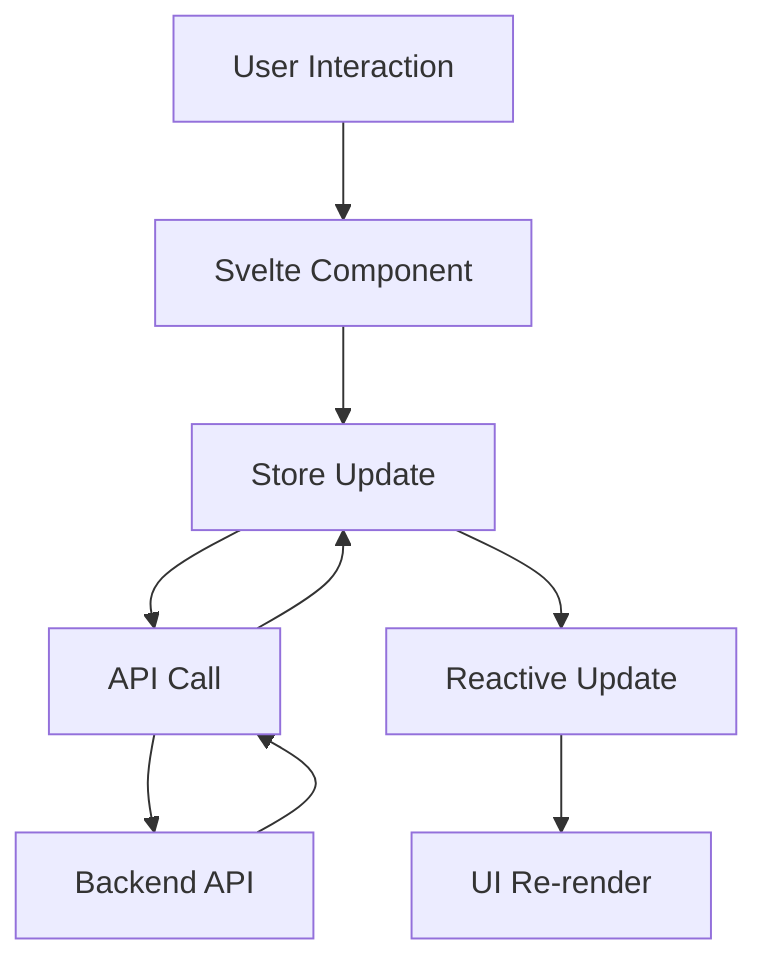

# Frontend - Mini Marketplace Services

> Interface web responsiva em SvelteKit + TailwindCSS para o marketplace de serviços

## 📋 Índice

- [Visão Geral](#-visão-geral)
- [Arquitetura](#-arquitetura)
- [Instalação](#-instalação)
- [Estrutura de Componentes](#-estrutura-de-componentes)
- [Roteamento](#-roteamento)
- [Estado Global](#-estado-global)
- [Estilização](#-estilização)
- [Desenvolvimento](#-desenvolvimento)
- [Build e Deploy](#-build-e-deploy)

## 🎯 Visão Geral

O frontend é uma Single Page Application (SPA) que oferece interface intuitiva para:

- **Clientes**: Descobrir serviços, comparar preços e fazer contratações
- **Prestadores**: Gerenciar serviços, agenda e contratações
- **Administração**: Dashboard e relatórios (futuro)

### Tecnologias

- **Framework**: SvelteKit 2.43.5
- **Styling**: TailwindCSS 3.4.10
- **Build Tool**: Vite 7.0.4
- **TypeScript**: Para stores e tipagem
- **Adapter**: Node.js para deploy

## 🏗 Arquitetura

### Estrutura de Pastas

```
frontend/
├── 📁 src/
│   ├── 📁 lib/
│   │   ├── 📁 components/       # Componentes reutilizáveis
│   │   │   ├── ServiceCard.svelte
│   │   │   ├── ServiceFilter.svelte
│   │   │   ├── BookingForm.svelte
│   │   │   ├── Navbar.svelte
│   │   │   ├── ServiceForm.svelte
│   │   │   └── AvailabilityCalendar.svelte
│   │   ├── 📁 stores/           # Estado global (Svelte stores)
│   │   │   ├── serviceStore.ts
│   │   │   ├── userStore.ts
│   │   │   └── bookingStore.ts
│   │   ├── 📁 styles/           # Estilos globais
│   │   │   └── theme.css
│   │   ├── 📁 assets/           # Imagens e recursos
│   │   │   ├── favicon.svg
│   │   │   ├── logo_grande.png
│   │   │   └── logo_pequena.png
│   │   └── index.js             # Exports da lib
│   ├── 📁 routes/               # Páginas e roteamento
│   │   ├── +layout.svelte       # Layout base
│   │   ├── +page.svelte         # Página inicial
│   │   ├── 📁 login/
│   │   │   └── +page.svelte
│   │   ├── 📁 register/
│   │   │   └── +page.svelte
│   │   ├── 📁 services/
│   │   │   └── 📁 [id]/
│   │   │       └── +page.svelte
│   │   └── 📁 prestador/
│   │       ├── 📁 dashboard/
│   │       ├── 📁 services/
│   │       ├── 📁 availability/
│   │       └── 📁 bookings/
│   ├── app.html                 # Template HTML base
│   └── app.css                  # Estilos globais
├── 📁 static/                   # Assets estáticos
│   └── robots.txt
├── 📄 package.json              # Dependências
├── 📄 svelte.config.js          # Configuração SvelteKit
├── 📄 tailwind.config.cjs       # Configuração Tailwind
├── 📄 vite.config.js            # Configuração Vite
└── 📄 Dockerfile                # Imagem Docker
```

### Fluxo de Dados



### Arquitetura de Componentes

```mermaid
graph TB
    subgraph "Layout"
        A[+layout.svelte] --> B[Navbar]
        A --> C[Main Content]
        A --> D[Footer]
    end
    
    subgraph "Pages"
        E[+page.svelte] --> F[ServiceCard]
        E --> G[ServiceFilter]
        H[services/[id]] --> I[BookingForm]
    end
    
    subgraph "Stores"
        J[serviceStore] --> K[API Client]
        L[userStore] --> K
        M[bookingStore] --> K
    end
    
    F --> J
    G --> J
    I --> M
```

## ⚡ Instalação

### Com Docker (Recomendado)

```bash
# Na raiz do projeto
docker-compose up -d frontend

# Verificar logs
docker-compose logs -f frontend
```

### Desenvolvimento Local

```bash
# 1. Instalar dependências
npm install

# 2. Iniciar servidor de desenvolvimento
npm run dev

# 3. Acessar aplicação
# http://localhost:5173
```

### Variáveis de Ambiente

Crie um arquivo `.env`:

```env
# API Backend
VITE_API_BASE=http://localhost:3000
VITE_SERVER_API_BASE=http://backend:3000

# Configurações da aplicação
VITE_APP_NAME="Mini Marketplace"
VITE_APP_VERSION="1.0.0"
```

## 🧩 Estrutura de Componentes

### ServiceCard.svelte

Componente para exibir informações de um serviço:

```svelte
<script>
  export let service;
</script>

<div class="bg-white border rounded-lg shadow hover:shadow-lg transition p-4">
  <h2 class="text-lg font-bold text-primary">{service.name}</h2>
  <p class="text-gray-600 mt-1">{service.description}</p>

  <div class="mt-3 space-y-1">
    {#each service.variations as v}
      <p class="text-sm text-gray-700">
        {v.name} — <span class="font-semibold text-secondary">R$ {v.price}</span> 
        ({v.durationMin} min)
      </p>
    {/each}
  </div>

  <a href={`/services/${service.id}`}
     class="btn btn-primary block text-center mt-4">
    Ver detalhes
  </a>
</div>
```

### ServiceFilter.svelte

Componente para filtrar serviços por categoria e busca:

```svelte
<script>
  export let categories = [];
  export let onFilter = () => {};

  let search = '';
  let selectedCategory = '';

  function handleFilter() {
    onFilter({ search, category: selectedCategory });
  }
</script>

<div class="bg-white p-4 rounded-lg shadow mb-6">
  <div class="grid grid-cols-1 md:grid-cols-3 gap-4">
    <!-- Campo de busca -->
    <input
      type="text"
      placeholder="Buscar serviços..."
      bind:value={search}
      on:input={handleFilter}
      class="input input-bordered"
    />
    
    <!-- Filtro por categoria -->
    <select
      bind:value={selectedCategory}
      on:change={handleFilter}
      class="select select-bordered"
    >
      <option value="">Todas as categorias</option>
      {#each categories as category}
        <option value={category}>{category}</option>
      {/each}
    </select>
    
    <!-- Botão limpar filtros -->
    <button
      on:click={() => { search = ''; selectedCategory = ''; handleFilter(); }}
      class="btn btn-outline"
    >
      Limpar filtros
    </button>
  </div>
</div>
```

### BookingForm.svelte

Formulário para contratação de serviços:

```svelte
<script>
  import { bookingStore } from '$lib/stores/bookingStore';
  
  export let service;
  export let variations = [];
  
  let selectedVariation = null;
  let selectedDate = '';
  let selectedTime = '';
  let loading = false;

  async function handleBooking() {
    if (!selectedVariation || !selectedDate || !selectedTime) {
      alert('Preencha todos os campos');
      return;
    }

    loading = true;
    try {
      await bookingStore.createBooking({
        variationId: selectedVariation.id,
        date: selectedDate,
        time: selectedTime
      });
      
      alert('Contratação realizada com sucesso!');
    } catch (error) {
      alert('Erro ao realizar contratação: ' + error.message);
    } finally {
      loading = false;
    }
  }
</script>

<div class="bg-white p-6 rounded-lg shadow">
  <h3 class="text-xl font-bold mb-4">Contratar Serviço</h3>
  
  <!-- Seleção de variação -->
  <div class="mb-4">
    <label class="label">Escolha uma opção:</label>
    {#each variations as variation}
      <label class="cursor-pointer label">
        <input
          type="radio"
          bind:group={selectedVariation}
          value={variation}
          class="radio radio-primary"
        />
        <span class="label-text ml-2">
          {variation.name} - R$ {variation.price} ({variation.durationMin}min)
        </span>
      </label>
    {/each}
  </div>
  
  <!-- Seleção de data -->
  <div class="mb-4">
    <label class="label">Data:</label>
    <input
      type="date"
      bind:value={selectedDate}
      class="input input-bordered w-full"
    />
  </div>
  
  <!-- Seleção de horário -->
  <div class="mb-4">
    <label class="label">Horário:</label>
    <select bind:value={selectedTime} class="select select-bordered w-full">
      <option value="">Selecione um horário</option>
      <option value="09:00">09:00</option>
      <option value="10:00">10:00</option>
      <option value="11:00">11:00</option>
      <option value="14:00">14:00</option>
      <option value="15:00">15:00</option>
      <option value="16:00">16:00</option>
    </select>
  </div>
  
  <!-- Botão de confirmação -->
  <button
    on:click={handleBooking}
    disabled={loading}
    class="btn btn-primary w-full"
  >
    {loading ? 'Processando...' : 'Confirmar Contratação'}
  </button>
</div>
```

## 🛣 Roteamento

### Estrutura de Rotas

```
/                           # Página inicial - lista de serviços
├── /login                  # Login de usuários
├── /register               # Cadastro de usuários
├── /services/[id]          # Detalhes do serviço + contratação
└── /prestador/             # Área do prestador
    ├── /dashboard          # Dashboard principal
    ├── /services           # Gerenciar serviços
    ├── /availability       # Definir agenda
    └── /bookings           # Contratações recebidas
```

### Página Principal (+page.svelte)

```svelte
<script>
  import { onMount } from 'svelte';
  import ServiceCard from '$lib/components/ServiceCard.svelte';
  import ServiceFilter from '$lib/components/ServiceFilter.svelte';

  let services = [];
  let filtered = [];
  let loading = false;
  let error = null;
  let categories = [];

  const API_BASE = import.meta.env.VITE_API_BASE ?? 'http://localhost:3000';

  async function loadServices() {
    loading = true;
    error = null;
    try {
      const res = await fetch(`${API_BASE}/servicos`);
      if (!res.ok) throw new Error(`HTTP ${res.status}`);
      const data = await res.json();

      // Normalizar dados do backend
      services = (data || []).map(s => ({
        id: s.id,
        name: s.nome ?? s.name,
        description: s.descricao ?? s.description,
        tipo: s.tipo,
        prestador: s.prestador,
        variations: (s.variacoes || []).map(v => ({
          id: v.id,
          name: v.nome ?? v.name,
          price: Number(v.preco ?? v.price ?? 0),
          durationMin: v.duracaoMin ?? v.duration ?? 0
        }))
      }));

      // Extrair categorias únicas
      categories = Array.from(new Set(
        services.map(s => s.tipo).filter(Boolean)
      ));

      filtered = services.slice();
    } catch (err) {
      console.error('Erro carregando serviços', err);
      error = err.message;
    } finally {
      loading = false;
    }
  }

  function handleFilter({ search, category }) {
    const q = (search || '').toLowerCase().trim();
    const cat = (category || '').toLowerCase().trim();
    
    filtered = services.filter(s => {
      const matchesSearch = !q || 
        (s.name && s.name.toLowerCase().includes(q)) || 
        (s.description && s.description.toLowerCase().includes(q));
      const matchesCategory = !cat || 
        (s.tipo && s.tipo.toLowerCase() === cat);
      return matchesSearch && matchesCategory;
    });
  }

  onMount(() => {
    loadServices();
  });
</script>

<svelte:head>
  <title>Mini Marketplace - Serviços Locais</title>
</svelte:head>

<h1 class="text-2xl font-bold mb-4">Serviços disponíveis</h1>

<ServiceFilter {categories} onFilter={handleFilter} />

{#if loading}
  <div class="flex justify-center py-8">
    <div class="loading loading-spinner loading-lg"></div>
  </div>
{:else if error}
  <div class="alert alert-error">
    <span>Erro ao carregar serviços: {error}</span>
  </div>
{:else}
  <div class="grid grid-cols-1 md:grid-cols-2 lg:grid-cols-3 gap-4 mt-4">
    {#each filtered as service}
      <ServiceCard {service} />
    {/each}
  </div>
  
  {#if filtered.length === 0}
    <div class="text-center py-8">
      <p class="text-gray-500">Nenhum serviço encontrado</p>
    </div>
  {/if}
{/if}
```

### Layout Base (+layout.svelte)

```svelte
<script>
  import '../app.css';
  import Navbar from '$lib/components/Navbar.svelte';
</script>

<div class="min-h-screen bg-gray-50">
  <Navbar />
  
  <main class="container mx-auto px-4 py-8">
    <slot />
  </main>
  
  <footer class="bg-gray-800 text-white py-8 mt-16">
    <div class="container mx-auto px-4 text-center">
      <p>&copy; 2024 Mini Marketplace Services. Todos os direitos reservados.</p>
    </div>
  </footer>
</div>
```

## 🗃 Estado Global

### serviceStore.ts

```typescript
import { writable } from "svelte/store";

export type Variation = {
  id: number;
  name: string;
  price: number;
  durationMin: number;
};

export type Service = {
  id: number;
  name: string;
  description: string;
  tipo: string;
  variations: Variation[];
  prestador?: {
    id: number;
    nome: string;
    email: string;
  };
};

export const services = writable<Service[]>([]);
export const loading = writable<boolean>(false);
export const error = writable<string | null>(null);

const API_BASE = import.meta.env.VITE_API_BASE ?? 'http://localhost:3000';

export const serviceStore = {
  // Carregar todos os serviços
  async loadAll() {
    loading.set(true);
    error.set(null);
    
    try {
      const response = await fetch(`${API_BASE}/servicos`);
      if (!response.ok) throw new Error(`HTTP ${response.status}`);
      
      const data = await response.json();
      services.set(data);
    } catch (err) {
      error.set(err instanceof Error ? err.message : 'Erro desconhecido');
    } finally {
      loading.set(false);
    }
  },

  // Buscar serviço por ID
  async getById(id: number) {
    try {
      const response = await fetch(`${API_BASE}/servicos/${id}`);
      if (!response.ok) throw new Error(`HTTP ${response.status}`);
      
      return await response.json();
    } catch (err) {
      throw new Error(err instanceof Error ? err.message : 'Erro ao buscar serviço');
    }
  },

  // Criar novo serviço
  async create(serviceData: Omit<Service, 'id'>) {
    try {
      const response = await fetch(`${API_BASE}/servicos`, {
        method: 'POST',
        headers: { 'Content-Type': 'application/json' },
        body: JSON.stringify(serviceData)
      });
      
      if (!response.ok) throw new Error(`HTTP ${response.status}`);
      
      const newService = await response.json();
      services.update(list => [...list, newService]);
      
      return newService;
    } catch (err) {
      throw new Error(err instanceof Error ? err.message : 'Erro ao criar serviço');
    }
  }
};
```

### userStore.ts

```typescript
import { writable } from "svelte/store";

export type User = {
  id: number;
  nome: string;
  email: string;
  role: 'CLIENTE' | 'PRESTADOR';
};

export const currentUser = writable<User | null>(null);
export const isAuthenticated = writable<boolean>(false);

export const userStore = {
  // Login
  async login(email: string, password: string) {
    // TODO: Implementar autenticação real
    try {
      // Simulação de login
      const user: User = {
        id: 1,
        nome: 'Usuário Teste',
        email,
        role: 'CLIENTE'
      };
      
      currentUser.set(user);
      isAuthenticated.set(true);
      
      // Salvar no localStorage
      localStorage.setItem('user', JSON.stringify(user));
      
      return user;
    } catch (err) {
      throw new Error('Credenciais inválidas');
    }
  },

  // Logout
  logout() {
    currentUser.set(null);
    isAuthenticated.set(false);
    localStorage.removeItem('user');
  },

  // Verificar se há usuário logado
  checkAuth() {
    const stored = localStorage.getItem('user');
    if (stored) {
      const user = JSON.parse(stored);
      currentUser.set(user);
      isAuthenticated.set(true);
    }
  }
};
```

### bookingStore.ts

```typescript
import { writable } from "svelte/store";

export type Booking = {
  id: number;
  clienteId: number;
  variacaoId: number;
  agendaId: number;
  status: 'ATIVA' | 'CANCELADA';
  contratadoEm: string;
};

export const bookings = writable<Booking[]>([]);

const API_BASE = import.meta.env.VITE_API_BASE ?? 'http://localhost:3000';

export const bookingStore = {
  // Criar nova contratação
  async create(bookingData: {
    clienteId: number;
    variacaoId: number;
    agendaId: number;
  }) {
    try {
      const response = await fetch(`${API_BASE}/contratacoes`, {
        method: 'POST',
        headers: { 'Content-Type': 'application/json' },
        body: JSON.stringify(bookingData)
      });
      
      if (!response.ok) {
        const error = await response.json();
        throw new Error(error.error || `HTTP ${response.status}`);
      }
      
      const newBooking = await response.json();
      bookings.update(list => [...list, newBooking]);
      
      return newBooking;
    } catch (err) {
      throw new Error(err instanceof Error ? err.message : 'Erro ao criar contratação');
    }
  },

  // Listar contratações do cliente
  async loadByClient(clientId: number) {
    try {
      const response = await fetch(`${API_BASE}/contratacoes/cliente/${clientId}`);
      if (!response.ok) throw new Error(`HTTP ${response.status}`);
      
      const data = await response.json();
      bookings.set(data);
      
      return data;
    } catch (err) {
      throw new Error(err instanceof Error ? err.message : 'Erro ao carregar contratações');
    }
  }
};
```

## 🎨 Estilização

### TailwindCSS Configuration

```javascript
// tailwind.config.cjs
module.exports = {
  content: ['./src/**/*.{html,js,svelte,ts}'],
  theme: {
    extend: {
      colors: {
        primary: {
          50: '#eff6ff',
          500: '#3b82f6',
          600: '#2563eb',
          700: '#1d4ed8'
        },
        secondary: {
          500: '#10b981',
          600: '#059669'
        }
      }
    }
  },
  plugins: [require('daisyui')],
  daisyui: {
    themes: ['light', 'dark']
  }
};
```

### Tema Customizado (theme.css)

```css
/* src/lib/styles/theme.css */

:root {
  --color-primary: #3b82f6;
  --color-secondary: #10b981;
  --color-accent: #f59e0b;
  --color-neutral: #6b7280;
  --color-base-100: #ffffff;
  --color-base-200: #f3f4f6;
  --color-base-300: #e5e7eb;
}

/* Componentes customizados */
.btn-primary {
  @apply bg-primary-500 hover:bg-primary-600 text-white font-medium py-2 px-4 rounded-lg transition-colors;
}

.btn-secondary {
  @apply bg-secondary-500 hover:bg-secondary-600 text-white font-medium py-2 px-4 rounded-lg transition-colors;
}

.card {
  @apply bg-white rounded-lg shadow-md border border-gray-200 p-6;
}

.input {
  @apply border border-gray-300 rounded-lg px-3 py-2 focus:outline-none focus:ring-2 focus:ring-primary-500 focus:border-transparent;
}

.select {
  @apply border border-gray-300 rounded-lg px-3 py-2 bg-white focus:outline-none focus:ring-2 focus:ring-primary-500 focus:border-transparent;
}

/* Animações */
.fade-in {
  animation: fadeIn 0.3s ease-in-out;
}

@keyframes fadeIn {
  from { opacity: 0; transform: translateY(10px); }
  to { opacity: 1; transform: translateY(0); }
}

.slide-up {
  animation: slideUp 0.3s ease-out;
}

@keyframes slideUp {
  from { transform: translateY(20px); opacity: 0; }
  to { transform: translateY(0); opacity: 1; }
}

/* Responsividade */
@media (max-width: 768px) {
  .container {
    @apply px-4;
  }
  
  .grid-responsive {
    @apply grid-cols-1;
  }
}

@media (min-width: 769px) {
  .grid-responsive {
    @apply grid-cols-2;
  }
}

@media (min-width: 1024px) {
  .grid-responsive {
    @apply grid-cols-3;
  }
}
```

### Estilos Globais (app.css)

```css
/* src/app.css */
@import '@tailwindcss/base';
@import '@tailwindcss/components';
@import '@tailwindcss/utilities';
@import './lib/styles/theme.css';

/* Reset e base styles */
* {
  box-sizing: border-box;
}

html {
  font-family: -apple-system, BlinkMacSystemFont, 'Segoe UI', Roboto, Oxygen, Ubuntu, Cantarell, sans-serif;
}

body {
  margin: 0;
  background-color: #f9fafb;
  color: #374151;
  line-height: 1.6;
}

/* Utilitários customizados */
.text-balance {
  text-wrap: balance;
}

.container {
  @apply max-w-7xl mx-auto px-4 sm:px-6 lg:px-8;
}

/* Estados de loading */
.loading-spinner {
  @apply animate-spin rounded-full border-4 border-gray-200 border-t-primary-500;
  width: 2rem;
  height: 2rem;
}

/* Alertas */
.alert {
  @apply p-4 rounded-lg mb-4;
}

.alert-error {
  @apply bg-red-50 border border-red-200 text-red-800;
}

.alert-success {
  @apply bg-green-50 border border-green-200 text-green-800;
}

.alert-warning {
  @apply bg-yellow-50 border border-yellow-200 text-yellow-800;
}

.alert-info {
  @apply bg-blue-50 border border-blue-200 text-blue-800;
}
```

## 🛠 Desenvolvimento

### Scripts Disponíveis

```bash
# Desenvolvimento
npm run dev              # Servidor de desenvolvimento
npm run dev -- --host   # Servidor acessível na rede

# Build
npm run build            # Build para produção
npm run preview          # Preview do build

# Utilitários
npm run prepare          # Sync do SvelteKit
npm run check            # Type checking
npm run lint             # Linting (se configurado)
```

### Configuração do SvelteKit

```javascript
// svelte.config.js
import adapter from '@sveltejs/adapter-node';
import { vitePreprocess } from '@sveltejs/vite-plugin-svelte';

const config = {
  preprocess: vitePreprocess(),
  
  kit: {
    adapter: adapter({
      out: 'build',
      precompress: false,
      envPrefix: 'VITE_'
    }),
    
    alias: {
      $components: 'src/lib/components',
      $stores: 'src/lib/stores',
      $styles: 'src/lib/styles'
    }
  }
};

export default config;
```

### Configuração do Vite

```javascript
// vite.config.js
import { sveltekit } from '@sveltejs/kit/vite';
import { defineConfig } from 'vite';

export default defineConfig({
  plugins: [sveltekit()],
  
  server: {
    host: '0.0.0.0',
    port: 5173
  },
  
  preview: {
    host: '0.0.0.0',
    port: 4173
  }
});
```

### Debugging

```javascript
// Habilitar debug no desenvolvimento
if (import.meta.env.DEV) {
  console.log('Modo desenvolvimento ativo');
  
  // Debug de stores
  import { services } from '$lib/stores/serviceStore';
  services.subscribe(value => {
    console.log('Services updated:', value);
  });
}
```

## 🚀 Build e Deploy

### Build para Produção

```bash
# Build da aplicação
npm run build

# Testar build localmente
npm run preview
```

### Docker

```dockerfile
# Dockerfile
FROM node:20-alpine AS builder

WORKDIR /frontend

COPY package*.json ./
RUN npm ci

COPY . .
RUN npm run build

FROM node:20-alpine AS runner

WORKDIR /frontend

COPY --from=builder /frontend/build ./build
COPY --from=builder /frontend/package.json ./
COPY --from=builder /frontend/node_modules ./node_modules

EXPOSE 5173

CMD ["node", "build"]
```

### Variáveis de Produção

```env
# .env.production
VITE_API_BASE=https://api.minimarketplace.com
VITE_APP_NAME="Mini Marketplace"
VITE_APP_VERSION="1.0.0"
NODE_ENV=production
```

### Otimizações

```javascript
// vite.config.js - Otimizações para produção
export default defineConfig({
  plugins: [sveltekit()],
  
  build: {
    minify: 'terser',
    rollupOptions: {
      output: {
        manualChunks: {
          vendor: ['svelte'],
          utils: ['$lib/stores']
        }
      }
    }
  }
});
```

---

## 📊 Performance

### Métricas Importantes

- **First Contentful Paint (FCP)**: < 1.5s
- **Largest Contentful Paint (LCP)**: < 2.5s
- **Cumulative Layout Shift (CLS)**: < 0.1
- **Time to Interactive (TTI)**: < 3.5s

### Otimizações Implementadas

- **Code Splitting**: Automático via SvelteKit
- **Tree Shaking**: Remoção de código não utilizado
- **Image Optimization**: Lazy loading de imagens
- **CSS Purging**: TailwindCSS remove classes não utilizadas

## 🔗 Links Úteis

- [SvelteKit Documentation](https://kit.svelte.dev/docs)
- [Svelte Tutorial](https://svelte.dev/tutorial)
- [TailwindCSS Documentation](https://tailwindcss.com/docs)
- [Vite Guide](https://vitejs.dev/guide/)

## 📞 Suporte

Para problemas específicos do frontend:

1. Verifique o console do navegador
2. Teste a conexão com a API: `curl http://localhost:3000`
3. Verifique os logs: `docker-compose logs -f frontend`
4. Consulte a documentação do SvelteKit

## Contato
- E-mail: jvitorbatista29@gmail.com
- [linkedin](https://www.linkedin.com/in/jo%C3%A3o-vitor-batista-silva-50b280279?utm_source=share&utm_campaign=share_via&utm_content=profile&utm_medium=android_app)
- João Vitor Batista Silva