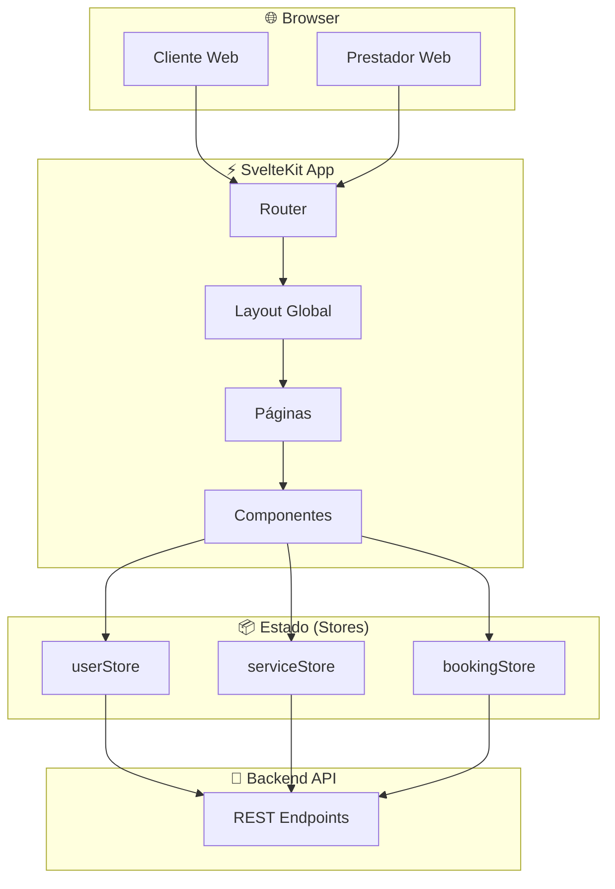
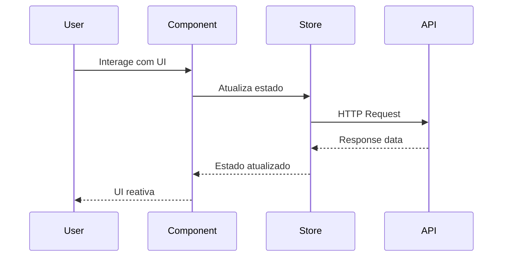
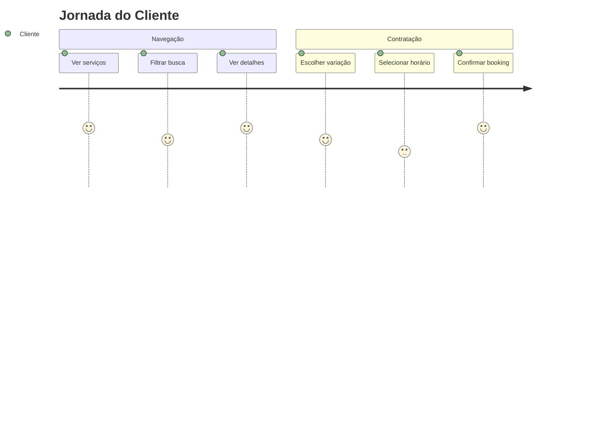
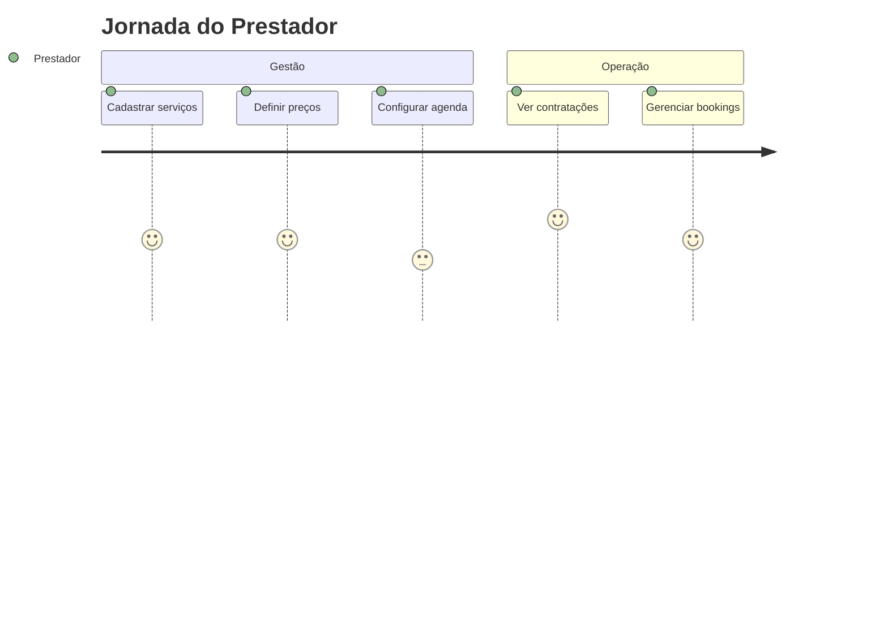

# Frontend - Mini Marketplace Services

Interface web moderna desenvolvida em SvelteKit para marketplace de serviços locais.

## 🎨 Arquitetura Frontend



## 🛠️ Stack Técnica

| Tecnologia | Versão | Função |
|------------|--------|--------|
| **SvelteKit** | ^2.43.5 | Framework principal + SSR |
| **Svelte** | ^5.0.0 | Componentes reativos |
| **TailwindCSS** | ^3.4.10 | Estilização utility-first |
| **Vite** | ^7.0.4 | Build tool + HMR |
| **TypeScript** | - | Tipagem (stores) |

## 📂 Estrutura de Arquivos

```
src/
├── 🎨 lib/
│   ├── components/          # Componentes reutilizáveis
│   │   ├── Navbar.svelte           # Navegação principal
│   │   ├── ServiceCard.svelte      # Card de serviço
│   │   ├── ServiceFilter.svelte    # Filtros de busca
│   │   ├── ServiceForm.svelte      # Cadastro de serviços
│   │   ├── BookingForm.svelte      # Formulário contratação
│   │   └── AvailabilityCalendar.svelte # Seletor de agenda
│   ├── stores/              # Estado global (Svelte stores)
│   │   ├── userStore.ts            # Autenticação + perfil
│   │   ├── serviceStore.ts         # CRUD serviços
│   │   └── bookingStore.ts         # Contratações
│   ├── styles/
│   │   └── theme.css               # Variáveis CSS customizadas
│   └── assets/
├── 🗂️ routes/               # Roteamento SvelteKit
│   ├── +layout.svelte              # Layout base
│   ├── +page.svelte                # Home (lista serviços)
│   ├── login/+page.svelte          # Tela de login
│   ├── register/+page.svelte       # Cadastro usuário
│   ├── prestador/                  # Área do prestador
│   │   ├── dashboard/+page.svelte      # Painel principal
│   │   ├── services/+page.svelte       # Gerenciar serviços
│   │   ├── availability/+page.svelte   # Configurar agenda
│   │   └── bookings/+page.svelte       # Ver contratações
│   └── servicces/[id]/             # Detalhes do serviço
│       └── +page.svelte
└── 🎨 app.css               # Estilos globais + Tailwind
```

## 🔄 Fluxo de Dados



## 🎯 Funcionalidades por Perfil

### 👤 Cliente


### 🔧 Prestador


## 📦 Stores (Estado Global)

### userStore.ts
```typescript
type User = {
  id: number;
  name: string;
  email: string;
  role: "cliente" | "prestador";
}
```
**Funções:** `loginFake()`, `logout()`

### serviceStore.ts
```typescript
type Service = {
  id: number;
  name: string;
  description: string;
  variations: Variation[];
}
```
**Funções:** `addService()`, `removeService()`

### bookingStore.ts
```typescript
type Booking = {
  id: number;
  serviceId: number;
  clientName: string;
  date: string;
  time: string;
}
```
**Funções:** `addBooking()`, `cancelBooking()`

## 🎨 Sistema de Design

### Cores (TailwindCSS)
```css
:root {
  --color-primary: #2563eb;      /* Azul principal */
  --color-secondary: #10b981;    /* Verde secundário */
  --color-gray: #6b7280;         /* Cinza neutro */
}
```

### Componentes Base
- `.btn` - Botão base
- `.btn-primary` - Botão principal (azul)
- `.btn-secondary` - Botão secundário (verde)

## ⚡ Desenvolvimento

```bash
# Instalar dependências
npm install

# Desenvolvimento (HMR)
npm run dev

# Build produção
npm run build

# Preview build
npm run preview
```

## 🐳 Docker

```dockerfile
# Multi-stage build
FROM node:20-alpine AS build
WORKDIR /app
COPY package*.json ./
RUN npm install
COPY . .
RUN npm run build

FROM node:20-alpine
WORKDIR /app
COPY --from=build /app/build ./build
EXPOSE 3000
CMD ["node", "build"]
```

## 🚧 Melhorias Futuras

- [ ] 🔐 Autenticação real (JWT)
- [ ] 📱 PWA + offline support
- [ ] 🌙 Dark mode
- [ ] 🌍 Internacionalização (i18n)
- [ ] ♿ Melhorias de acessibilidade
- [ ] 📊 Analytics de uso